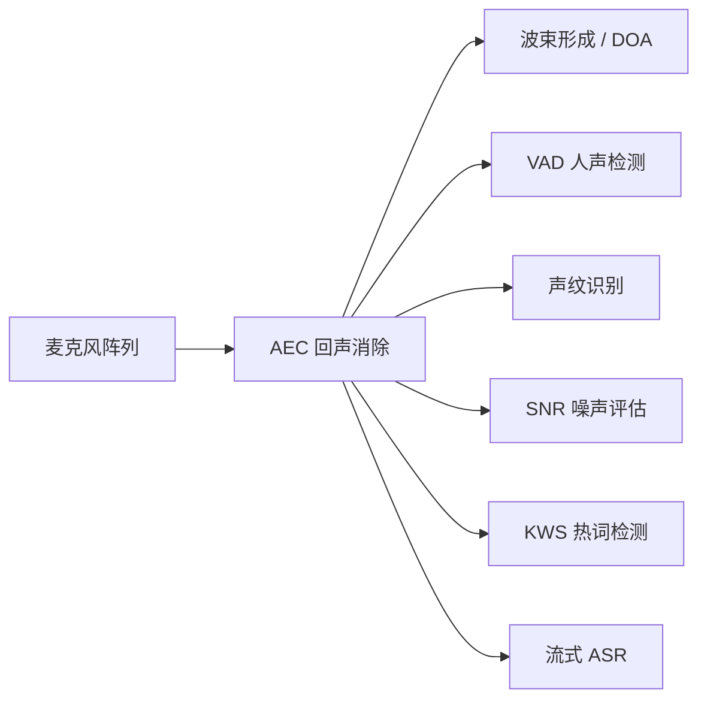
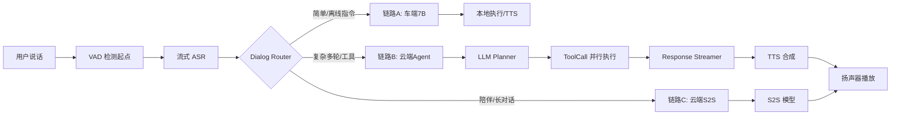

# 车机语音助手整体架构

> 本文覆盖端云协同架构、模块划分与关键链路，是整个 Wiki 的架构底图。
> 其他专项文档（语音能力、语义与对话、大模型 Agent 等）均以本文为依托展开。

---

## 1. 架构全景

### 1.1 分层模型

车机语音助手采用**三层**纵向架构：**车端感知与执行层、端云协同中间层、云端推理与服务层**，横向按信号流向分为「输入链路 → 理解与规划 → 输出链路」。

```
┌─────────────────────────────────────────────────────────────────┐
│  车端（Edge）                                                     │
│  ┌───────────────┐  ┌──────────────────┐  ┌──────────────────┐  │
│  │  声学前端      │  │  端侧推理引擎     │  │  执行与输出      │  │
│  │  麦阵/AEC/BF  │  │  KWS/VAD/ASR     │  │  TTS渲染/车控   │  │
│  │  DOA/SNR/声纹 │  │  端侧 7B + 状态机 │  │  CAN/多媒体     │  │
│  └───────┬───────┘  └────────┬─────────┘  └────────▲─────────┘  │
│          │                   │                       │            │
└──────────┼───────────────────┼───────────────────────┼────────────┘
           │   WebRTC/QUIC 长连接（流式双向）            │
           ▼                   ▼                       │
┌─────────────────────────────────────────────────────────────────┐
│  云端（Cloud）                                                    │
│  ┌──────────────────────────────────────────────────────────┐   │
│  │  接入 & 路由层                                             │   │
│  │  鉴权 / 限流 / 链路路由（链路A车端7B / B云端传统 / C S2S） │   │
│  └──────────────────────────┬───────────────────────────────┘   │
│                              ▼                                    │
│  ┌──────────────────────────────────────────────────────────┐   │
│  │  Agent Orchestrator（核心编排层）                          │   │
│  │  Context Manager | LLM Planner | Tool Router | Streamer   │   │
│  └──────────────────────────┬───────────────────────────────┘   │
│                              ▼                                    │
│  ┌──────────────────────────────────────────────────────────┐   │
│  │  工具 / 技能层（Tool Registry）                            │   │
│  │  车控 | 导航 | 音乐 | 通讯 | 天气 | 搜索 | RAG 知识库      │   │
│  └──────────────────────────┬───────────────────────────────┘   │
│                              ▼                                    │
│  ┌──────────────────────────────────────────────────────────┐   │
│  │  记忆 & 数据层                                             │   │
│  │  Redis(会话) | 向量库(长期记忆) | 用户画像 | 车况状态快照   │   │
│  └──────────────────────────────────────────────────────────┘   │
└─────────────────────────────────────────────────────────────────┘
```

### 1.2 三代架构演进定位

| 代际 | 核心范式 | 主链路 | 当前状态 |
|------|---------|--------|---------|
| **第一代** | NLU Workflow + 规则 | ASR → NLU → DM → NLG → TTS | 存量维护 |
| **第二代** | LLM Agent + ToolCall | ASR → ReAct Agent → ToolCall → TTS | **当前主流** |
| **第三代** | 多模态 Realtime (S2S) | 语音 → 统一 Token → 语音 | 布局中 |

> 详细演进分析见：[车机语音助手后端架构演进展望](../xp_project/车机语音助手后端架构演进展望.md)

---

## 2. 车端模块划分

### 2.1 声学前端



| 模块 | 职责 | 关键指标 |
|------|------|---------|
| **AEC**（回声消除） | 去除扬声器回灌，防止自打断 / 自触发 | 回声抑制深度 ≥ 30dB |
| **BF / DOA**（波束形成） | 空间滤波，增强目标方向信号，输出说话人方位 | 方位角分辨率 < 15° |
| **VAD**（语音活动检测） | 检测人声起/止点，控制 ASR 分帧与打断触发 | 端点延迟 < 80ms |
| **声纹识别** | 说话人身份鉴别，支持主驾绑定与多用户区分 | 1:N 识别 FAR < 1% |
| **SNR 评估** | 实时信噪比估计，动态调整判决阈值 | — |
| **KWS**（热词/关键词检测） | 唤醒词 + 强打断词 + 高频车控短词，毫秒级响应 | 误唤醒 < 1次/10h |
| **流式 ASR** | 实时语音转文字，边说边出字，支持 Partial/Final 结果 | TTFT ≤ 300ms |

### 2.2 端侧推理引擎

| 模块 | 职责 |
|------|------|
| **端侧 7B 模型** | L2 语义仲裁（打断确认 / 拒识 Addressee Detection / 简单 ToolCall）；INT4 量化 + NPU 加速，首 Token 250~400ms |
| **多音区状态机** | 管理主驾/副驾/后排各 zone 独立会话状态（IDLE/LISTENING/THINKING/SPEAKING）；维护 zone_id / session_id / reply_id |
| **Dialog Router** | 根据意图置信度、query 复杂度、网络状况，将请求分发到链路 A（车端 7B）/ B（云端传统）/ C（云端 S2S） |
| **交互判决引擎** | 融合 VAD/KWS/声纹/7B 输出，做打断 / 拒识 / 判不停 的分层实时决策；详见 [共用骨架](./03-语音能力/00-交互判决共用骨架.md) |

### 2.3 执行与输出

| 模块 | 职责 |
|------|------|
| **TTS 渲染** | 将云端/端侧生成的文本合成语音，支持流式播放（边生成边播）；多音区独立队列，由 Arbiter 调度物理扬声器 |
| **车控执行** | 通过 CAN / 私有总线执行车控指令（空调、车窗、座椅、灯光等）；高危指令需二次确认 |
| **媒体执行** | 音乐/广播/导航语音的播放控制与优先级仲裁 |

---

## 3. 云端模块划分

### 3.1 接入与路由层

| 模块 | 职责 |
|------|------|
| **会话网关** | 管理 WebRTC / QUIC / gRPC 长连接；Session 粘性路由（同一用户必须路由到同一推理实例） |
| **鉴权 & 限流** | Token 校验、VIN 绑定、QPS 控制 |
| **链路路由器** | 链路 A/B/C 分发；链路切换仅发生在轮次边界 |

### 3.2 Agent Orchestrator（核心编排层）

```
Agent Orchestrator
├─ Context Manager     ← 短期记忆（当前轮会话 + 车况快照）+ 长期记忆（向量库 RAG）
├─ LLM Planner         ← 基础大模型，意图理解 + ReAct 规划 + 参数补全
├─ Tool Router         ← ToolCall 路由、并行调度、幂等保障、失败降级
└─ Response Streamer   ← 流式回包，首 Token 优先输出；TTFT 目标 ≤ 800ms
```

**关键设计点：**

- **流式优先**：ASR 流式出字 → LLM prefix caching 边收边推 → TTS 边合成边播，整链路流水线化
- **并行 ToolCall**：同一轮中无依赖关系的工具（如导航 + 音乐）并行执行，节省 200~400ms
- **上下文压缩**：长对话触发摘要机制，防止 Context 爆炸；短期 + 长期记忆分层管理

### 3.3 工具 / 技能层

| 工具域 | 代表能力 | 延迟敏感度 |
|--------|---------|-----------|
| **车控** | 空调、车窗、座椅、灯光、门锁 | 极高（本地 RPC ≤ 200ms） |
| **导航** | POI 搜索、路线规划、实时重规划 | 高 |
| **媒体** | 音乐搜索/播放、广播、播客 | 中 |
| **通讯** | 电话、短信、联系人查询 | 高 |
| **信息查询** | 天气、日历、百科、新闻 | 中 |
| **RAG 知识库** | 车辆手册、品牌知识、政策法规 | 中 |
| **MCP 外部工具** | 三方 App 接入（接口标准化扩展） | 低 |

> **扩展模式**：新能力 = 注册一个 Tool Schema（description + args），无需改编排逻辑。

### 3.4 记忆与数据层

| 存储 | 内容 | 生命周期 |
|------|------|---------|
| **Redis** | 当前会话上下文、多轮对话历史 | 会话级（唤醒→超时） |
| **向量库** | 用户长期偏好、历史行为摘要 | 持久（按用户隔离） |
| **用户画像** | 音乐偏好、常用目的地、家庭成员、方言偏好 | 持久 |
| **车况状态快照** | 速度、电量/油量、位置、车内温度、座舱状态 | 实时（CAN 推送） |

---

## 4. 关键链路

### 4.1 语音交互主链路（LLM Agent 架构）



**主链路时延分解（链路 B，P95 参考值）：**

| 阶段 | 耗时 |
|------|------|
| ASR 最终结果 | 0 ms（基准） |
| 网关路由 | + 20ms |
| LLM 首 Token（云端） | + 400~700ms |
| 简单 ToolCall（本地 RPC） | + 50~200ms |
| TTS 首包合成 | + 200~400ms |
| **用户可感知首响应** | **≤ 1200ms（目标）** |

### 4.2 多音区会话链路

每个 zone 持有独立状态，物理输出由 Arbiter 串行调度：

```
Zone主驾: state=SPEAKING, reply_id=R1, TTS queue=[...], context=[...]
Zone副驾: state=LISTENING, session_id=S2, context=[...]
Zone后排: state=IDLE

            Arbiter（跨音区调度器）
                ↓
            扬声器组（主驾优先，非主驾不抢占主驾播报）
```

**主驾绝对优先原则**：

- 主驾开口 → 全舱让渡，即使副驾/后排正在接受回复
- 强打断词（"停"）由主驾说 → 全舱停播；由副驾说 → 仅停副驾回复
- zone_id 贯穿所有判决事件，防止归属混乱

> 多音区规则全集见：[交互判决共用骨架 §4](./03-语音能力/00-交互判决共用骨架.md#4-共用多音区规则)

### 4.3 打断链路（SPEAKING → LISTENING）

```
用户开口
  ↓ VAD 起点检测（< 80ms）
  ↓ L1 声学门控：fade-out TTS
  ↓ L1.5 热词仲裁：强打断词快路径
  ↓ L2 车端 7B 语义确认（300~500ms，可撤销 L1.5）
  ↓ 云端 cancel（异步，幂等）
  ↓ 新轮次建立
```

> 详见：[打断能力](./03-语音能力/01-打断能力.md)

### 4.4 车控指令链路

```
语音输入 → ASR → [端侧7B 或 云端LLM] → ToolCall: car_control(action, params)
                                          ↓
                                     Schema 校验 + 白名单检查
                                          ↓
                                  [高危指令] → 二次确认 TTS
                                  [普通指令] → CAN 总线执行
                                          ↓
                                     执行结果回报 → TTS 播报
```

**延迟要求**：车控类指令端到端 P95 ≤ 500ms（敏感指令优先走链路 A 端侧兜底）

### 4.5 导航意图链路

```
"找个安静的咖啡馆导航过去" → LLM 规划
  ├─ Action 1: search_poi(keyword="安静咖啡馆") ─────────┐
  └─ [等 POI 结果] → Action 2: start_navigation(dest=...) │ 串行依赖
                              │
                              └─ Action 3: set_seat_heater(on=true) ← 并行无依赖
```

---

## 5. 端云协同策略

### 5.1 分流决策矩阵

| 场景 | 走链路 | 原因 |
|------|--------|------|
| 高频车控（空调/车窗/音量） | A（端侧 7B） | 延迟敏感，无需联网 |
| 离线场景（无网） | A 兜底 | 可用性保障 |
| 复杂多步指令 | B（云端 Agent） | 规划能力要求高 |
| 长尾开放问答 | B（云端 Agent） | 知识密集 |
| 陪伴 / 情感对话 | C（云端 S2S） | 自然流畅，低延迟 |
| 隐私敏感（通讯录/位置） | A（端侧处理） | 数据不出车 |

> **典型端云命中比**：链路 A : B : C ≈ 7 : 2 : 1（因产品形态而异）

### 5.2 弱网 / 断网降级策略

```
网络质量检测
    ↓ 正常 → 按策略路由
    ↓ 弱网 → 超时阈值收紧，优先链路 A
    ↓ 断网 → 全量切链路 A，仅端侧白名单 Tool 可用
              ← 高频车控 + 本地导航缓存地图 + 离线 TTS
```

---

## 6. 关键非功能设计

### 6.1 可观测性

每次完整交互记录：

```
session_id → turn_id → zone_id
  user_audio_tokens / asr_text
  → thought (LLM 推理过程)
  → tool_calls + tool_results
  → final_response_text + tts_audio
  → 端到端延迟各阶段打点
```

关键指标：任务成功率、ToolCall 准确率、ASR WER、TTS MOS、P50/P95 端到端时延、跨音区误判率

### 6.2 安全边界

| 层级 | 措施 |
|------|------|
| **车控安全** | ToolCall 白名单 + 高危动作二次确认 + 沙箱隔离 |
| **内容安全** | LLM 输出过滤，行驶中限制复杂信息展示 |
| **隐私安全** | 通讯录/位置等敏感 Tool 端侧处理，原始音频可选不上云 |
| **车规合规** | 行车中语音入口限流，强制驾驶安全提示优先级最高 |

### 6.3 灰度与 OTA

- 端侧模型通过 OTA 下发，支持热切换（不重启车机）
- 云端 Prompt / Tool Schema 版本化管理，A/B 灰度到单车粒度
- 双轨运行期间，旧 NLU 作为 fallback，Agent 置信度低时降级

---

## 7. 架构约束与设计原则

1. **链路切换边界**：链路 A/B/C 的切换只发生在轮次边界，单轮内不切换
2. **zone_id 贯穿**：所有判决事件、协议字段必须携带 zone_id，防止多音区归属混乱
3. **车控幂等**：车控类 ToolCall 必须设计为幂等，失败可安全重试
4. **停 TTS 不后悔**：打断触发 fade-out 后，即使 L2/L3 判决更新也不恢复本轮播报（宁错杀）
5. **流式优先**：任何链路都应尽量实现流式输出，首包时延优先于总时延

---

## 参考与延伸

- [交互判决共用骨架](./03-语音能力/00-交互判决共用骨架.md) — 打断/拒识的感知栈与状态机
- [打断能力](./03-语音能力/01-打断能力.md)
- [拒识能力](./03-语音能力/02-拒识能力.md)
- [VAD 能力](./03-语音能力/04-VAD.md)
- [架构升级原因与收益（第一→二代）](../xp_project/架构升级原因与收益.md)
- [车机语音助手后端架构演进展望（第二→三代）](../xp_project/车机语音助手后端架构演进展望.md)
- [豆包实时语音架构 - S2S 链路参考](../doubao_realtime_voice/README.md)

## 相关项目经验

- 闲聊智能体实现细节见 [[xp_project/闲聊智能体/闲聊智能体全链路设计]]
- 架构升级背景与收益见 [[xp_project/架构升级原因与收益]]
- 后端架构演进三代路线图见 [[xp_project/车机语音助手后端架构演进展望]]
