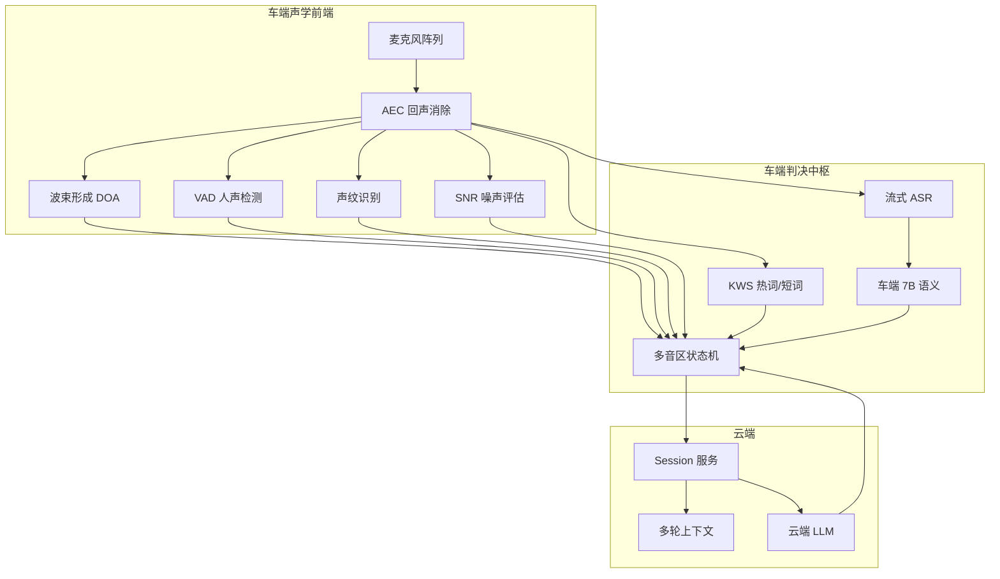
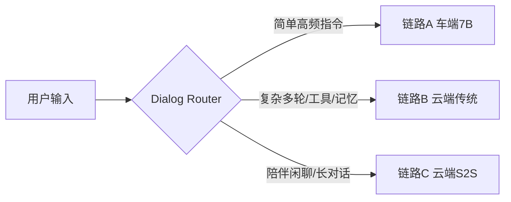
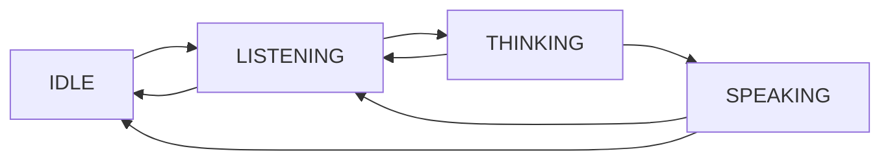

# 实时交互判决共用骨架（Decision Skeleton）

> **打断（Barge-in）** 与 **拒识（Rejection）** 都是在连续音频流上做"要不要响应 / 要不要停下"的实时二元判决，共用同一套 **感知信号栈、分层判决框架、多音区规则、链路路由、端云协议**。为避免两份文档各自重复建模，本文抽出两者的公共骨架：
>
> - [打断能力](./01-打断能力.md) 在此骨架上聚焦 "SPEAKING 态 → LISTENING 态 的停 + cancel 逻辑"
> - [拒识能力](./02-拒识能力.md) 在此骨架上聚焦 "IDLE/LISTENING 态 → 是否受理本次输入 的过滤逻辑"

---

## 1. 定位与范围

### 1.1 为什么要抽共用骨架

| 维度 | 打断 | 拒识 | 共用程度 |
| --- | --- | --- | --- |
| 判决对象 | 要不要停下现在的播报/执行 | 要不要响应这段语音 | 都是"响应 / 不响应"的二元实时判决 |
| 输入信号 | AEC/VAD/DOA/声纹/KWS/ASR/7B/云端上下文 | 同上 | **几乎完全一致** |
| 延迟要求 | P95 ≤ 300ms 停 TTS | P95 ≤ 200ms 过滤短噪 | 同一量级，同一预算分层 |
| 多音区规则 | 主驾优先 / 非主驾不抢占 | 主驾优先 / 非主驾不抢占 | **必须统一**，否则逻辑分裂 |
| 链路路由 | A 车端 7B / B 云端传统 / C 云端 S2S | 同上 | 走同一张路由表 |

如果两套能力各建一套感知栈，会导致：**算力翻倍、一致性缺失、多音区判决冲突、Badcase 无法统一归因**。抽一层共用骨架后，两篇文档只需描述各自的"触发条件 + 执行动作 + 偏好阈值"。

### 1.2 本文档不讨论什么

- 打断特有的 `停 TTS 永不后悔 + 150ms 动作仲裁窗口`：见 [打断能力](./01-打断能力.md)。
- 拒识特有的 `Addressee Detection 分类器、场景化拒识阈值`：见 [拒识能力](./02-拒识能力.md)。
- 唤醒词检测本身的声学模型、VAD 模型选型、TTS 合成链路：属于上下游模块。

---

## 2. 共用感知信号栈

| 信号 | 在打断中的用途 | 在拒识中的用途 |
| --- | --- | --- |
| AEC | 去回声，避免自打断 | 去回声，避免播报回灌触发 |
| VAD | 开口检测 → fade-out | 人声门控 → 是否进入判决 |
| DOA | 主驾方向确认 | 说话人归属判决 |
| 声纹 | 主驾身份绑定 | 是否目标说话人 |
| SNR | 低信噪比提阈值 | 低信噪比直接拒 |
| KWS | 强打断词、快路径 | 短词/语气词黑名单 |
| 流式 ASR | 喂给 7B 做语义仲裁 | 喂给 7B 判"对车说" |
| 车端 7B | L2 语义仲裁 | L2 Addressee 分类 |
| 云端上下文 | 复杂打断意图 | 多轮会话归属 |

---

## 3. 共用分层判决框架

### 3.1 四层预算

| 层级 | 位置 | 延迟预算 | 打断动作 | 拒识动作 |
| --- | --- | --- | --- | --- |
| **L1 声学门控** | 车端 DSP | < 80ms | fade-out TTS | 丢帧 / 不建 session |
| **L1.5 词表仲裁** | 车端 CPU/DSP | 50–120ms | 强打断词 / 快路径 | 短词黑名单 / 噪声词过滤 |
| **L2 语义仲裁** | 车端 7B | 300–500ms | 确认意图 / 就地响应 | Addressee Detection / 指令合理性 |
| **L3 云端兜底** | 云端 LLM | 秒级 | Cancel 工具链 + 记忆沉淀 | 多轮语境判决 + Badcase 回流 |

**设计要点**：同一段音频**串行经过四层**，每层独立给出 `继续 / 终止 / 待定` 三态输出，由状态机融合决策。层间不互相阻塞，后层可推翻前层（例如 L2 可撤销 L1.5 的快路径动作）。

### 3.2 车端 7B 的定位

车端 7B 在两条能力里**都只承担 L2**，不承担 L1：

- 7B 首 token 即便 INT4 量化 + NPU 加速也要 150–400ms 起，**跑不进 L1 的 80ms 窗口**。
- 7B 真正的价值是"TTS 已停 / 还没建 session 时的语义二次确认"，负责把 L1/L1.5 的误判纠回来。

---

## 4. 共用多音区规则

### 4.1 会话并行 + 音频串行

每个 zone（主驾 / 副驾 / 后排左 / 后排右）独立持有 `state / reply_id / TTS queue / context / memory scope`，逻辑完全并行；物理扬声器由跨音区仲裁器（Arbiter）串行调度。

### 4.2 主驾绝对优先（打断 & 拒识同时遵守）

| 规则 | 打断侧表现 | 拒识侧表现 |
| --- | --- | --- |
| 主驾绝对优先 | 主驾开口 → 全舱让渡 | 主驾输入 → 最高受理优先级 |
| 非主驾不抢占 | 副驾/后排不能打断主驾播报 | 副驾/后排输入不建主驾 session |
| 强打断词仅主驾全舱生效 | "停"由副驾说只能停自己 | 同理，副驾"停"不改主驾拒识态 |
| DOA + 声纹联合门控 | 主驾方向 + 主驾声纹 才算主驾 | 同一套门控，结果共享 |

### 4.3 zone_id 贯穿

所有判决事件（VAD 触发、KWS 命中、7B 意图、云端仲裁）**必须带 `zone_id`**，以免两条能力对同一段音频给出归属不一致的结论。

---

## 5. 共用链路路由

| 链路 | 打断落点 | 拒识落点 |
| --- | --- | --- |
| A 车端 7B | L1 + 7B 上下文内打断 | L1 + 7B 入口拒识 |
| B 云端传统 | L1 + 云端 Cancel 协议 | L1 + 云端 session 建立前拒识 |
| C 云端 S2S | L1 兜底 + S2S 自让位 | L1 兜底 + S2S 内部拒识 |

**约束**：链路切换**只能发生在轮与轮之间**，单轮对话内的打断判决与拒识判决必须落在同一条链路上。

---

## 6. 共用端云协议字段

### 6.1 贯穿 ID

| ID | 作用 | 打断使用 | 拒识使用 |
| --- | --- | --- | --- |
| `session_id` | 一次唤醒到空闲的完整会话 | ✓ | ✓ |
| `turn_id` | 单轮请求/回复 | ✓ | ✓ |
| `reply_id` | 一次 TTS 回复流 | ✓ 定位要 cancel 的流 | — |
| `zone_id` | 音区归属 | ✓ | ✓ |

### 6.2 判决事件基础字段

| 字段 | 含义 | 备注 |
| --- | --- | --- |
| `event_type` | `barge_in` / `reject` | 共用事件通道 |
| `trigger_source` | `vad` / `kws` / `sv` / `nlu` / `key` | 触发信号 |
| `confidence` | 判决置信度 | 供云端二次仲裁 |
| `zone_id` | 音区 | 必填 |
| `timestamp` | 触发时刻 | 便于时序对齐 |
| `reason_code` | 判决原因枚举 | Badcase 归因 |

### 6.3 幂等与可追溯

- 判决事件上报可能**重试**，云端必须幂等处理（按 `turn_id + event_type` 去重）。
- 每次判决落日志，供后续 Badcase 挖掘与阈值调优。

---

## 7. 共用状态机

| 状态迁移 | 打断参与 | 拒识参与 |
| --- | --- | --- |
| `IDLE → LISTENING` | — | **拒识决定是否真的进入 LISTENING** |
| `LISTENING → THINKING` | — | **拒识决定是否建 session 送云端** |
| `SPEAKING → LISTENING` | **打断主导**（L1 即可触发） | 打断触发后拒识判断新输入是否受理 |
| `THINKING → LISTENING` | 打断 cancel 云端任务 | — |

两条能力共享状态机实例，判决事件作为状态机的 **guard condition**，避免两套状态机相互覆写。

---

## 8. 共用评测框架

### 8.1 指标骨架（打断 / 拒识 各自替换语义即可）

| 指标 | 打断语义 | 拒识语义 |
| --- | --- | --- |
| 召回率 | 应打断成功打断占比 | 应拒识成功拒识占比 |
| 误触率 | 不该打断被打断占比 | 不该拒识被拒识占比 |
| P95 判决时延 | 人声起点 → TTS 静音 | 人声起点 → 判决输出 |
| 跨音区误判率 | 非主驾误打断主驾 | 非主驾误建主驾 session |

### 8.2 共用测试集维度

- **正样本**：主驾真实交互、各路况噪声、多说话人。
- **负样本**：车内闲聊、广播/音乐人声、咳嗽路噪、儿童玩闹。
- **多音区**：主副驾同时说话、后排干扰、强打断词由非主驾说出。
- **长尾**：方言、极快/极慢语速、同音歧义、唤醒词混入。

测试集**一次采集，两条能力共用**，通过不同的标签视角复用。

---

## 9. 打断 vs 拒识 差异速查

| 维度 | 打断 | 拒识 |
| --- | --- | --- |
| 默认偏好 | 宁错杀不放过（停 TTS 不后悔） | 宁漏响不乱响（不响应更安全） |
| 主要触发态 | SPEAKING / THINKING | IDLE / LISTENING（也覆盖 SPEAKING 协同） |
| 执行动作 | fade-out TTS + cancel | 丢帧 / 不建 session |
| 150ms 仲裁窗口 | 有（动作留一步后悔） | 无（拒了就拒） |
| 云端 Cancel | 必须 | 一般不需要 |
| 与判不停耦合 | 弱 | 强（VAD 尾点 + 二次确认） |
| 多模态优先级 | 辅助 | 更关键（视线 / 唇动） |

具体展开见各自章节，本文只负责"相同的那部分"。

---

## 10. 演进共识

1. **统一的判决中枢**：长期看，打断 / 拒识 / 判不停 / 唤醒后确认 合入同一个"交互判决引擎"，输出多维决策（take/reject/interrupt/continue）。
2. **多模态融合**：视线 / 唇动 / 手势 / 方向盘按键作为共用输入，降低声学单点依赖。
3. **端到端 S2S 原生化**：链路 C 扩容后，模型内部原生处理打断与拒识，车端骨架保留作为兜底。
4. **共用挖掘 → 阈值闭环**：Badcase 回流到同一个挖掘 Pipeline，输出的阈值/词表/记忆对两条能力同时生效。

---

## 参考与延伸

- [打断能力（Barge-in）](./01-打断能力.md)
- [拒识能力（Rejection）](./02-拒识能力.md)
- [豆包实时语音架构](../../doubao_realtime_voice/README.md)
- [半端到端架构详解](../../doubao_realtime_voice/05-半端到端架构详解.md)
- [车机语音助手后端架构演进展望](../../xp_project/车机语音助手后端架构演进展望.md)
