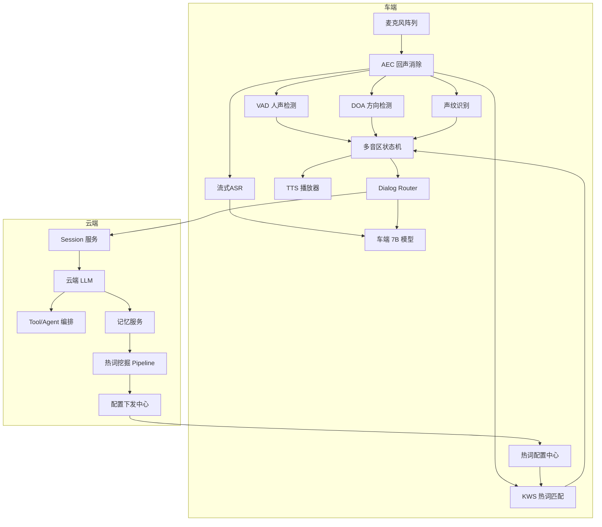
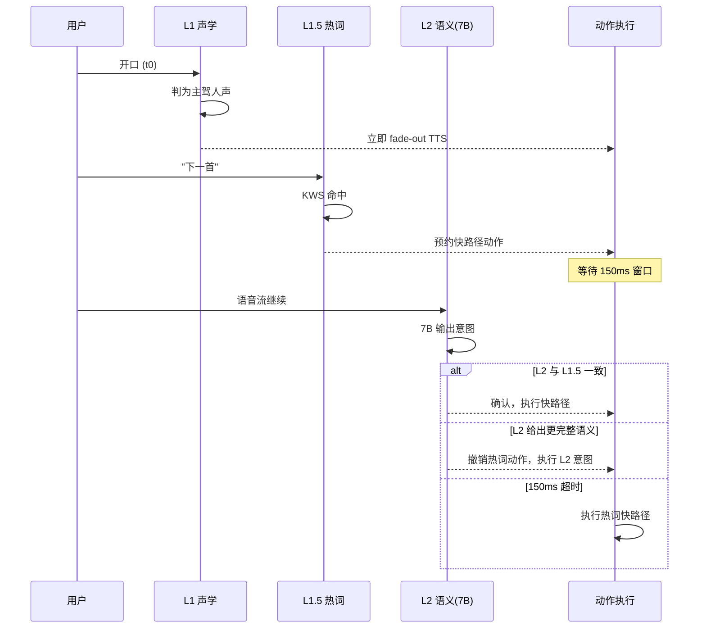
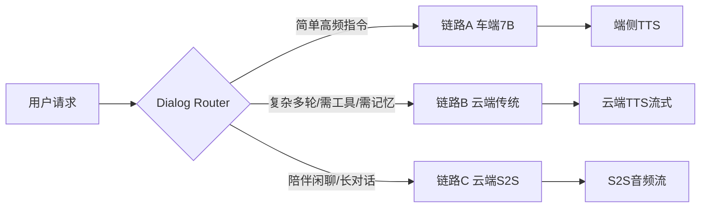
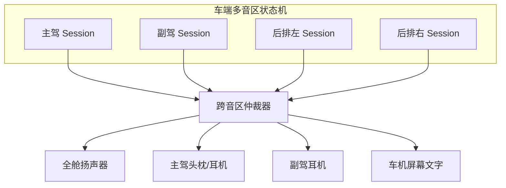
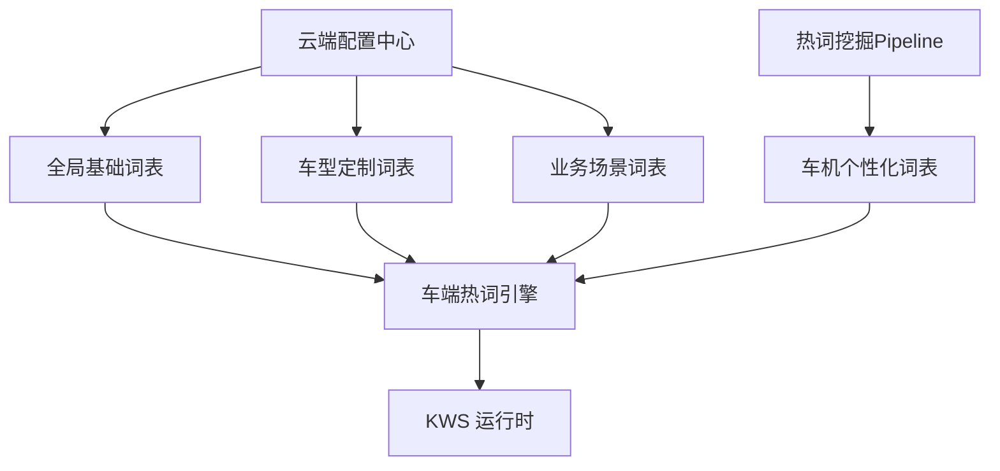
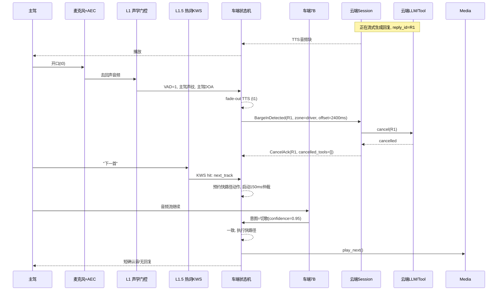
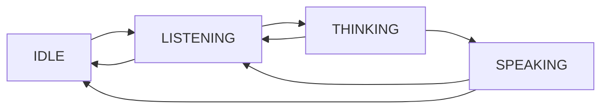

# 打断能力（Barge-in）

> 打断是指用户在语音助手 **正在播报 TTS** 或 **正在执行任务** 的过程中，主动中止当前输出、发起新一轮交互的能力，是自然对话体验的核心指标之一。本文沉淀车机场景下的完整打断方案，包含 **四层打断架构、链路路由、多音区协同、热词词表、端云联动协议** 等核心设计决策。
>
> **前置阅读**：打断与拒识共用的感知栈、分层框架、多音区规则、链路路由、状态机等见 [交互判决共用骨架](./00-交互判决共用骨架.md)。本文只聚焦打断**特有**的执行语义（停 TTS + cancel + 150ms 动作仲裁）。

---

## 1. 设计目标与核心原则

### 1.1 目标
- **开口到静音 ≤ 300ms（P95）**：用户体感"说停就停"。
- **打断误触 < 1%**：副驾、乘客、音乐、路噪不能误打断主驾播报。
- **弱网/离线可用**：车端具备独立打断与响应能力。
- **多音区独立**：主驾、副驾、后排各有独立 session，互不干扰。
- **链路可演进**：传统链路与 S2S 端到端链路共存、可平滑切换。

### 1.2 核心原则
1. **停 TTS 永不后悔**：只要声学层怀疑主驾开口，立刻 fade-out，宁错杀不放过。
2. **动作执行留一步**：热词命中后，等 150ms 给语义层二次确认，避免"说错了没救"。
3. **停了就不续**：一律放弃本轮，不做续播，简化端云状态同步。
4. **车端主导、云端兜底**：物理停播只能发生在车端；云端负责语义仲裁、生成取消、副作用补偿。
5. **主驾绝对优先**：非主驾只能打断自己，强打断词仅主驾可触发全舱打断。

---

## 2. 整体架构总览

---

## 3. 四层打断架构

### 3.1 分层表

| 层级 | 位置 | 技术 | 延迟预算 | 核心作用 |
| --- | --- | --- | --- | --- |
| **L1 声学门控** | 车端 DSP | VAD + AEC + DOA + 声纹 | < 80ms | 立即 fade-out TTS |
| **L1.5 热词仲裁** | 车端 CPU/DSP | KWS + 可配置词表 | 50~120ms | 强打断词 / 快路径指令 |
| **L2 语义仲裁** | 车端 7B | 流式 ASR + 7B 意图 | 300~500ms | 语义二次确认 + 端侧就地响应 |
| **L3 云端兜底** | 云端 LLM | 完整上下文 | 秒级 | 复杂语义 / Tool Cancel / 记忆沉淀 |

### 3.2 为什么 7B 不承担 L1

- 打断拒识预算只有 100~150ms，7B 即使 INT4 量化 + NPU，首 token 150~400ms 起，跑不进这个窗口。
- 7B 真正的位置是 **"L2 语义仲裁 + 端侧就地响应"**：TTS 已经停了，判断是否进入新一轮、能否就地完成（不上云）。

### 3.3 L1.5 热词三类词表

| 类别 | 举例 | 策略 |
| --- | --- | --- |
| **强打断词** | 停 / 别说了 / 闭嘴 / 算了 / 不要了 | 命中立即停 TTS + 走快路径 |
| **快路径指令** | 下一首 / 音量大点 / 关空调 / 导航回家 | 命中绕过 7B/云端，直接调车控/媒体服务 |
| **会话路由词** | 我要听歌 / 我要导航 | 命中拉起对应技能 session，跳过意图分类 |

### 3.4 热词命中后的 150ms 仲裁窗口

**本质**：停 TTS 绝不后悔，执行动作留一步后悔空间。

---

## 4. 链路路由（S2S 开关）

### 4.1 三条链路并存

| 链路 | 打断机制 | 备注 |
| --- | --- | --- |
| A 车端 7B | L1 声学 + 7B 上下文内打断 | 7B 自己管自己，全离线可用 |
| B 云端传统 | L1 声学 + 云端 Cancel 协议 | 主要业务链路，外挂打断状态机 |
| C 云端 S2S | L1 声学兜底 + 模型内部让位 | 车端只保留物理键 + 极端兜底 VAD，其他不干预 |

### 4.2 切换约束

**链路切换只能发生在轮与轮之间**。单轮对话内，S2S 与传统链路状态模型不同（一个是 audio token 流，一个是文本 + TTS），中途热切必然导致打断/记忆错乱。

### 4.3 车端打断层的链路感知

打断事件的路由目标不同：
- 链路 A：事件只发给本地 7B runtime。
- 链路 B：事件发给云端 Session 服务，cancel LLM/Tool。
- 链路 C：只做本地 fade-out，不发 cancel（S2S 自己感知音频流中断）。

---

## 5. 多音区独立会话

### 5.1 会话并行模型

每个 Session 独立持有：`state / reply_id / TTS queue / LLM context / memory scope`。

### 5.2 输出通道路由

扬声器硬件方案为 **全舱播报 + 屏幕文字 + 头枕扬声器/蓝牙耳机**（妥协方案），Session 逻辑并行、音频物理串行。

| 发起者 | 主驾耳机 | 全舱扬声器 | 副驾耳机 | 屏幕文字 |
| --- | --- | --- | --- | --- |
| 主驾 | ✓ 优先 | ✓ 默认 | × | ✓ 辅助 |
| 副驾（无耳机）| × | 排队/降级 | × | ✓ **主通道** |
| 副驾（有耳机）| × | × | ✓ **主通道** | ✓ 辅助 |
| 后排 | × | × | 若有耳机 ✓ | ✓ **主通道** |

关键规则：**全舱扬声器默认主驾独占**，主驾静默 500ms 以上才可借给非主驾；主驾一旦开口，全舱音频立即让渡，非主驾未播完内容自动切屏幕继续显示。

### 5.3 跨音区打断规则

| 场景 | 规则 |
| --- | --- |
| 主驾 TTS 中，副驾发起 | **不打断主驾**，副驾请求入队，走耳机或屏幕 |
| 主驾 TTS 中，主驾开口 | 完整四层打断链路 |
| 副驾屏幕 TTS 中，主驾开口 | **立即释放**给主驾 |
| 副驾耳机 TTS 中，主驾开口 | **不打断**（物理上不冲突），主驾正常响应 |
| 副驾耳机 TTS 中，副驾开口 | 正常走副驾打断链路 |
| 多人同时开口 | DOA + 声纹仲裁，**主驾优先建 session**，其他入队/屏幕提示 |

**强打断词（"停"/"闭嘴"/"别说了"）只允许主驾触发全舱打断。** 非主驾说这类词仅能打断自己的 session。

### 5.4 热词的 zone 绑定

L1.5 命中必须带 `zone_id`（由 DOA + 声纹打标），按跨音区规则表决定执行路径。例如后排小孩说"停"不应打断主驾导航播报。

---

## 6. 热词词表管理

### 6.1 分层结构

| 词表类别 | 来源 | 典型示例 | 更新频率 |
| --- | --- | --- | --- |
| 全局基础 | 云端 OTA | 停 / 下一首 / 导航回家 | 月级 |
| 车型定制 | 云端下发 | 车型专属功能词 | 季度级 |
| 业务场景 | 云端下发 | 团购、车队、节日活动 | 周级 |
| 车机个性化 | 离线挖掘 | 常去地点 / 常联系人 | 天级 |

### 6.2 场景化激活（折中方案）

- **车端常驻基础场景**：媒体（播放/切歌）、导航（回家/公司）、空调/车窗、强打断词。低延迟、离线可用。
- **云端下发业务场景**：团购、车队、节日活动、车型定制包。可细调、可灰度。
- 车端状态机感知当前场景（正在放音乐时激活"下一首"组，否则关闭），避免高危词误触发。

### 6.3 对抗误触发

- 高危词（"停" vs "停车场"）需专门做长尾测试与歧义消解。
- 热词召回由 KWS 做，但**是否执行**由跨音区规则 + 150ms 仲裁窗口共同决定。

---

## 7. 车机级个性化挖掘

### 7.1 粒度决策

采用 **车机级共享词表**：全车所有用户共享一张挖掘出的热词表，冷启动即可用，账号切换无感。

### 7.2 挖掘 Pipeline

### 7.3 防污染策略

1. **词共享、参数个性化**：热词"回公司"全车共享，但"公司"这个地址按说话人的声纹绑定到个人。
2. **短期声纹衰减**：租车/借车场景，未登录声纹的贡献权重大幅衰减；可选"主用户白名单"（默认关）。
3. **隐私合规**：
   - 挖掘只存"频次 + 语义簇"，不落对话内容。
   - 车机设置提供"清除个性化词表"入口。

---

## 8. 端云联动协议

### 8.1 三个核心事件

| 事件 | 方向 | 关键字段 |
| --- | --- | --- |
| `BargeInDetected` | 车端 → 云端 | `reply_id`、`zone_id`、`played_offset_ms`、`trigger_type`（vad/kws/key）、`confidence` |
| `CancelAck` | 云端 → 车端 | `reply_id`、`cancelled_tools[]`、`side_effects[]`、`status` |
| `ResumePlayback` | 云端 → 车端（**当前方案禁用**） | —— "停了就不续"简化方案下不启用 |

### 8.2 贯穿 ID

每一轮回复挂 `turn_id + reply_id`，打断事件必须带此 ID，云端据此定位要 cancel 的 LLM/Tool 任务。

### 8.3 Cancel 要求

- **幂等**：车端可能重试上报。
- **可追溯**：每次 cancel 落日志（reply_id、取消到哪一步、tool 是否来得及拦截）。
- **副作用处理**：
  - 纯查询类：直接丢弃结果。
  - 已发出的车控/短信/支付：标记为"用户已打断"，由业务侧决定回滚或确认（不由打断链路直接回滚）。

---

## 9. 完整时序图（链路 B，主驾打断场景）

---

## 10. 状态机

说明：
- `SPEAKING` → `LISTENING`：打断事件触发（L1 即可，不等 L2）。
- `THINKING` → `LISTENING`：生成中被打断（必须 cancel 云端任务）。
- 每个 zone 有独立的状态机实例，跨 zone 仲裁由 Arbiter 控制输出通道。

---

## 11. 评测指标

| 指标 | 定义 | 目标 |
| --- | --- | --- |
| 打断召回率 | 应打断场景成功打断占比 | > 95% |
| 打断误触率 | 不该打断被误打断占比 | < 1% |
| 打断响应时延 P95 | 人声起点 → TTS 静音 | ≤ 300ms |
| 打断后首响时延 P95 | 打断 → 新回复首音 | ≤ 800ms |
| Cancel 传播成功率 | 下游 LLM/Tool 成功取消占比 | > 99% |
| 热词命中准确率 | 命中即用户意图占比 | > 98% |
| 跨音区误打断率 | 非主驾误打断主驾播报占比 | < 0.1% |

**测试集建设**：
- 正样本：主驾各噪声环境下的真打断语料。
- 负样本：副驾闲聊、车内音乐、广播人声、咳嗽路噪。
- 多音区：主副驾同时说话 / 后排干扰 / 强打断词由非主驾说出。
- 长尾：方言、语速极快/极慢、唤醒词同音字。

---

## 12. 常见 Badcase 与对策

| Badcase | 根因 | 对策 |
| --- | --- | --- |
| 自打断 | AEC 不干净 | 强化 AEC + 参考信号对齐 + 打断判决加"非自播音"校验 |
| 副驾误打断主驾 | 未做声纹/DOA 绑定 | L1 加主驾声纹门控 + 波束限定 |
| 背景音乐误触 VAD | 歌声被当人声 | 歌声/音乐判别模型 + 播放音乐时提升阈值 |
| 说"好的"被打断 | 文本级拒识太松 | 短词 + 低置信度 → 不打断 |
| 打断后 TTS 余响 | 播放缓冲过大 | 小缓冲 + fade-out + flush |
| LLM 未真 cancel | reply_id 未贯穿 | 统一 turn_id/reply_id + cancel token 贯穿全链路 |
| 热词"停"与"停车场"冲突 | KWS 短词歧义 | 场景化激活 + 150ms 仲裁窗口由 L2 确认 |
| 租车导致个性化污染 | 未做声纹加权 | 短期声纹衰减 + 主用户白名单（可选） |

---

## 13. 演进方向

1. **全端到端接管**：链路 C 逐步扩容，由 S2S 模型原生决定"让位"，减少外挂状态机延迟与割裂。
2. **个性化阈值**：根据用户历史打断习惯，动态调节 L1/L1.5 阈值（有人偏短、有人偏听完）。
3. **多模态打断**：视线/手势/方向盘按键协同，替代部分语音打断，降噪更彻底。
4. **可解释打断**：给用户"已为您停止"等反馈，避免"默默消失"的突兀感。
5. **挖掘 → 记忆 → 阈值**闭环：被频繁打断的回复形态，自动回流记忆服务，影响后续生成风格。

---

## 14. 关键决策汇总（一张表）

| 决策点 | 结论 |
| --- | --- |
| 打断分层 | L1 声学 / L1.5 热词 / L2 车端7B语义 / L3 云端兜底 |
| 7B 定位 | L2 语义仲裁 + 端侧就地响应（**不承担** L1 低延迟拒识） |
| 执行原则 | 停 TTS 永不后悔 + 动作等 150ms + 停了不续 |
| 链路路由 | A 车端 7B / B 云端传统 / C 云端 S2S，轮间切换 |
| 扬声器方案 | 全舱播报 + 屏幕文字 + 头枕/蓝牙耳机 |
| 多音区 | 需支持，每 zone 独立 session |
| 跨音区规则 | 主驾绝对优先 + 非主驾只能打断自己 |
| 热词场景化 | 车端常驻基础 + 云端下发业务 |
| 个性化粒度 | 车机级共享词，参数按声纹个性化 |
| 副驾无耳机 | 默认走屏幕文字 + 短提示音 |

---

## 参考与延伸

- 本仓库相关：
  - [豆包实时语音架构](../../doubao_realtime_voice/README.md)
  - [半端到端架构详解](../../doubao_realtime_voice/05-半端到端架构详解.md)
  - [车机语音助手后端架构演进展望](../../xp_project/车机语音助手后端架构演进展望.md)
