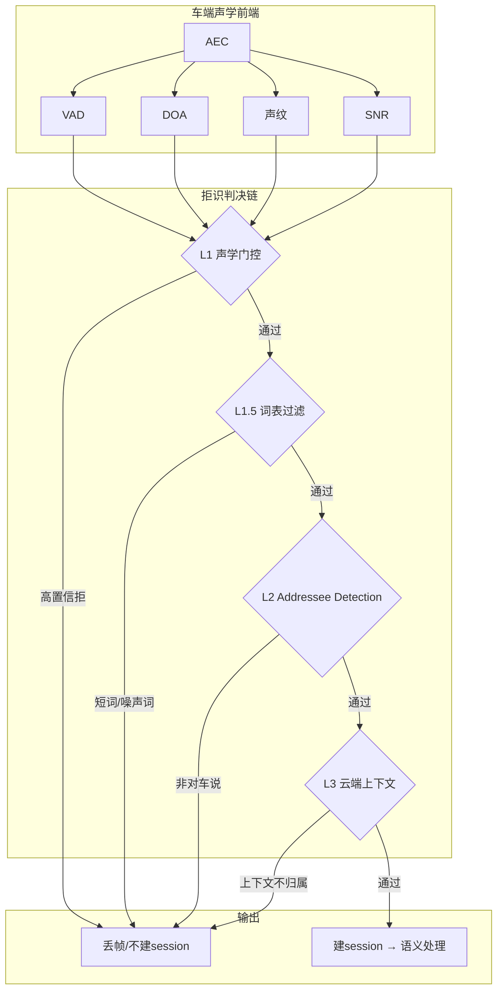
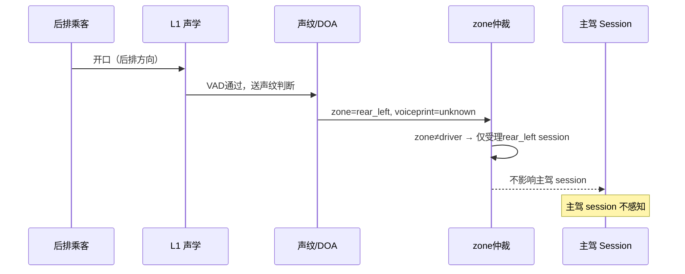
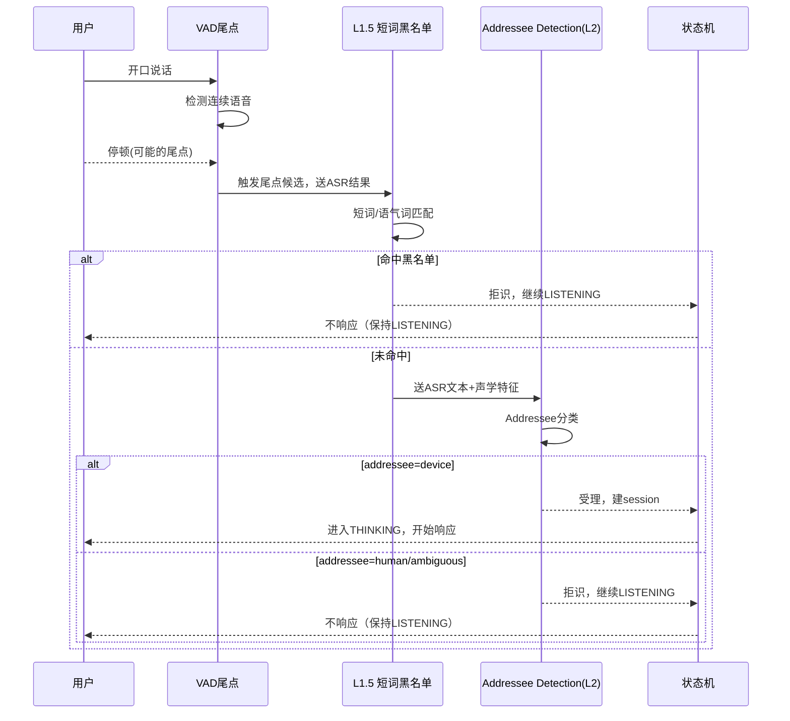
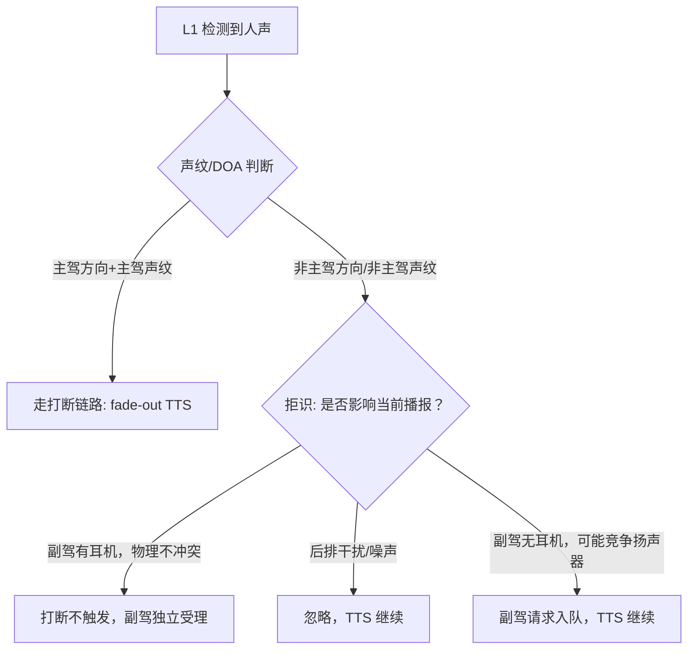
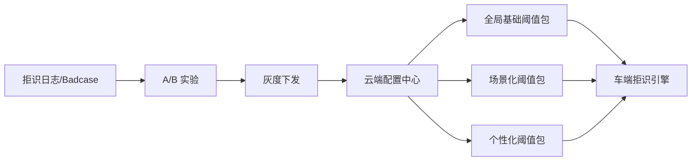

# 拒识能力（Rejection）

> 拒识是指语音助手在 **唤醒 / 免唤醒 / 全双工** 等不同交互模式下，对 **非指令语音、非目标说话人、环境噪声、闲聊旁白** 等输入做出"不响应 / 不打断 / 不执行"的判决能力。与打断能力互为孪生：打断解决"该停就停"，拒识解决"该不响就不响"。
>
> **前置阅读**：拒识与打断共用的感知栈、分层框架、多音区规则、链路路由、状态机等见 [交互判决共用骨架](./00-交互判决共用骨架.md)。本文只聚焦拒识**特有**的内容。

---

## 目录

- [1. 设计目标与核心原则](#1-设计目标与核心原则)
- [2. 拒识的典型场景分类](#2-拒识的典型场景分类)
- [3. 整体架构总览（拒识视角）](#3-整体架构总览拒识视角)
- [4. 分层拒识架构](#4-分层拒识架构)
- [5. 关键技术点](#5-关键技术点)
- [6. 多音区下的拒识策略](#6-多音区下的拒识策略)
- [7. 与判不停能力的协同](#7-与判不停能力的协同)
- [8. 与打断能力的协同](#8-与打断能力的协同)
- [9. 链路路由下的拒识差异](#9-链路路由下的拒识差异)
- [10. 端云联动协议](#10-端云联动协议)
- [11. 拒识阈值管理与场景化配置](#11-拒识阈值管理与场景化配置)
- [12. 评测指标与测试集](#12-评测指标与测试集)
- [13. 常见 Badcase 与对策](#13-常见-badcase-与对策)
- [14. 演进方向](#14-演进方向)
- [15. 关键决策汇总](#15-关键决策汇总)
- [参考与延伸](#参考与延伸)

---

## 1. 设计目标与核心原则

### 1.1 业务目标

| 指标 | 定义 | 目标值 |
| --- | --- | --- |
| 误响应率 FAR | 应拒识被误受理占比 | < 1% |
| 漏响应率 FRR | 应受理被误拒识占比 | < 3% |
| 拒识判决 P95 时延 | 人声起点 → 拒识结论输出 | ≤ 200ms |
| Addressee 准确率 | "是否对车说"二分类准确率 | > 95% |
| 跨音区误受理率 | 非主驾输入被建主驾 session 占比 | < 0.5% |

FAR 与 FRR 存在天然的权衡：阈值收紧则 FAR 降（误响少），但 FRR 升（漏响增）。车机场景**偏向 FAR 更严**——用户不断被打扰比偶尔说一遍没响应危害更大，且漏响可通过"用户重说"自然兜底。

### 1.2 核心原则

1. **宁漏响不乱响**：模糊场景一律不响应，与打断的"宁错杀不放过"方向相反。
2. **拒了就拒、不留后悔窗口**：命中后直接丢帧、不建 session，不需要 150ms 仲裁（这是打断的机制）。
3. **多模态优先**：视线 / 唇动 / 朝向对拒识的价值远高于打断，能大幅降低误响。
4. **场景化阈值**：导航中、播放音乐中、静默中的拒识阈值差异极大，不能用统一阈值。
5. **不自作主张停 TTS**：拒识判决本身不触发停 TTS，停 TTS 是打断的职责（两者协同时以打断侧决策为准）。

### 1.3 与相邻能力的边界划分

| 能力 | 判决问题 | 发生时机 | 执行动作 |
| --- | --- | --- | --- |
| **唤醒** | 是否唤醒词 | 持续监听 | 进入 LISTENING 态 |
| **拒识** | 是否应受理这段输入 | IDLE / LISTENING / SPEAKING | 丢帧 / 不建 session |
| **判不停** | 说话是否结束（尾点） | LISTENING 态内 | 触发 ASR 结束 + 语义处理 |
| **打断** | 是否停下当前播报/执行 | SPEAKING / THINKING 态 | fade-out TTS + cancel |

---

## 2. 拒识的典型场景分类

### 2.1 唤醒后拒识（误唤醒过滤）

唤醒词触发后，L1.5 + L2 对首句话做"是否真的是指令"的二次确认：
- **触发条件**：ASR 转写结果为空 / 只有噪声 / 置信度极低。
- **典型 case**：路边播音、广播说出近似唤醒词后的背景音被误唤醒。
- **处理**：L1 声学层发现信噪比持续低于阈值，主动退出 LISTENING，不建 session。

### 2.2 免唤醒 / 全双工拒识（最高频场景）

在连续对话 / 免唤醒模式下，车内所有声音都会进入判决管道：
- **车内闲聊**：主驾、副驾之间说话（"你觉得今晚吃什么"），不是对车说。
- **对他人说话**：乘客接打电话、车内广播内容。
- **背景媒体**：音乐歌词、导航语音回灌。

这类场景量最大、FAR 贡献最高，是 Addressee Detection 的主战场。

### 2.3 多音区拒识（非主驾说话、后排干扰）

非主驾 zone 的输入在到达系统时就应做早期拒识过滤：
- **后排儿童**：高频率随机发音，需在 L1 层靠声纹+DOA 直接拒。
- **副驾闲聊**：触发副驾 zone 受理，但不应影响主驾 session。
- **判决原则**：非主驾输入只在自己的 zone 内受理，不应跨区触发主驾 session。

### 2.4 播报中拒识（与打断的协同判决）

TTS 播报中，L1 声学层检测到人声时，需要"打断 vs 拒识"联合判决：
- 若声学层判定是主驾主动开口 → **触发打断**，停 TTS，进入新一轮。
- 若声学层判定是噪声/非主驾/非指令 → **触发拒识**，TTS 继续播放，不进入新一轮。

### 2.5 连续对话拒识（判不停之后的追加判决）

尾点判定之后，拒识做最后一道过滤：
- VAD 触发尾点 → 短词黑名单过滤（"嗯 / 啊 / 好的"）→ Addressee Detection → 合法则建 session。
- 长停顿中说了半句又停顿（思考噪声）：VAD 可能多次误触，拒识需配合判不停做"说完了才受理"的联合判决。

---

## 3. 整体架构总览（拒识视角）

感知信号栈与通用模块见骨架第 2 节。本节给出**拒识路径**的调用视角：

**与打断链路的关键区别**：拒识是"串行过滤漏斗"，打断是"立即触发 + 后验撤销（150ms 窗口）"。

### 3.1 模块职责对照

| 模块 | 拒识职责 | 打断职责 |
| --- | --- | --- |
| AEC | 去回声，防回灌触发 | 去回声，防自打断 |
| VAD | 人声门控（低 SNR 直接拒） | 开口触发 fade-out |
| DOA + 声纹 | 说话人 zone 归属 → 拒非目标 | 确认主驾 → 触发打断 |
| KWS / 短词黑名单 | 语气词 / 噪声词过滤 | 强打断词 / 快路径指令触发 |
| 车端 7B | Addressee Detection | 语义仲裁 + 就地响应 |
| 云端上下文 | 多轮归属判别 | Cancel 工具链 |

---

## 4. 分层拒识架构

各层延迟预算见骨架第 3 节。本节给出拒识侧各层的**具体执行动作、阈值设计与降级策略**。

### 4.1 L1 声学层拒识

| 信号 | 拒识规则 |
| --- | --- |
| VAD 置信度 | < 阈值（随场景动态调整）→ 直接拒 |
| SNR | < 5dB 且无强烈指向性 → 直接拒 |
| DOA | 方向不在主驾弓形区间内（±45°）→ 降优先级 |
| 声纹 | 声纹评分未达主驾声纹 → 标记为非主驾输入 |

**自适应阈值**：播放音乐时 VAD 阈值上调 10–15dB（避免歌声误触）；行驶高速噪声段上调 SNR 要求。

### 4.2 L1.5 短词 / 语气词黑名单

| 词表类别 | 示例 | 策略 |
| --- | --- | --- |
| 语气词 | 嗯 / 啊 / 哦 / 哈 / 呢 | ASR 结果匹配后直接拒，不进 L2 |
| 确认词 | 好的 / 对 / 知道了 / 嗯嗯 | 单独出现时拒；但跟在上一轮问句后例外（判不停协同） |
| 噪声词 | 咳嗽 / 清嗓子 / 叹气 | 声学特征匹配后直接拒 |
| 高危歧义词 | 停（vs 停车场）/ 好（vs 好帅） | 不直接拒，送 L2 Addressee Detection |

**黑名单更新**：词表与打断的热词词表共用配置中心，同频下发。

### 4.3 L2 语义层拒识（Addressee Detection）

车端 7B 做轻量化"是否对车说"的二分类判决，详见第 5 节。

- **输入**：ASR 文本 + 声纹评分 + 当前场景标签 + 上一轮对话摘要。
- **输出**：`addressee=device | human | ambiguous` + `confidence`。
- **分支**：
  - `device` + 高置信 → 建 session，进入语义处理。
  - `human` + 高置信 → 直接拒，不上云。
  - `ambiguous` 或置信度低 → 上送 L3 云端上下文兜底。

### 4.4 L3 云端上下文拒识

L2 无法判决的歧义场景交由云端：

- **多轮归属**："他说的那家" → 判断是否指向当前会话上下文。
- **人称代词消解**：结合前几轮对话，判断"他 / 她 / 那个"是不是在对车说。
- **降级兜底**：超时（> 2s）或网络不可用时，以 L2 的结论为准。

---

## 5. 关键技术点

### 5.1 Addressee Detection（"对车说"分类器）

这是拒识的核心差异化模块，骨架不涉及。

**输入特征**：

| 特征 | 说明 |
| --- | --- |
| ASR 文本 | 主要内容特征；短词场景下 ASR 可能为空，需结合声学 |
| 声纹评分 | 是否主驾声纹；非主驾声纹降权重 |
| DOA 方向 | 声源方向；偏向前方、指向车机屏幕方向得分高 |
| 场景标签 | 当前导航中 / 播音乐 / 静默 / 多人聊天 |
| 上一轮摘要 | 判断是否是对话的接续（"那就那样吧"是否在回应车机） |
| 多模态信号（可选） | 视线方向 / 唇动检测 / 手势 |

**模型选型**（折中方案）：

- **车端轻量分类器**：基于 ASR 文本 + 场景标签的规则/小模型，延迟 < 50ms，覆盖 80% 高置信场景。
- **车端 7B Prompt 判决**：对轻量分类器置信度低的歧义输入，走 7B 做语义理解，延迟 200–400ms，属 L2 层。
- **云端兜底**：仅对 7B 也无法判决的跨轮指代，上云处理（异步，不阻塞当前轮）。

**典型正负样本对比**：

| 文本 | addressee | 判断依据 |
| --- | --- | --- |
| "导航去机场" | device | 明确车控指令 |
| "你觉得机场哪个航站楼方便" | human | 人称提问，非车控语义 |
| "那就导航过去吧" | device（高概率） | 接续上轮车机应答 |
| "好的" | ambiguous | 上下文决定；单独出现则拒 |
| "下一首" | device | 媒体控制指令 |
| "我说你别唱歌了" | human | 人称指向他人 |

### 5.2 声纹 + DOA 联合说话人归属

骨架第 2 节有信号说明，本节给拒识侧的具体策略：

- **主驾声纹门控**：声纹评分未达主驾模型阈值时，输入降级为"非主驾候选"，只允许进入对应 zone 的 session，不建主驾 session。
- **DOA 辅助**：车内噪声下声纹置信度低时，以 DOA 方向作为 tiebreaker（偏前方 + 驾驶座方向优先）。
- **声纹 + DOA 联合评分**：`zone_score = α × voiceprint_score + β × doa_score`，阈值之上受理，之下拒识。
- **冷启动**：新用户无声纹基线时，以 DOA 为主，降低拒识阈值（宁误响一次以便完成声纹注册）。

### 5.3 唇动 / 视线 / 朝向等多模态辅助信号

多模态对拒识的价值 > 对打断（因为"是否在对车说"比"是否在说话"更难从声音判断）：

| 信号 | 采集方式 | 用途 |
| --- | --- | --- |
| 视线方向 | DMS 摄像头 / IR 传感器 | 看向车机屏幕 → 提高 device 置信度 |
| 唇动检测 | 前向摄像头 | 说话的是主驾 / 副驾 → 辅助 DOA |
| 手势 | 方向盘 / 中控摄像头 | 指向车机 → 强辅助信号 |
| 头部朝向 | DMS | 低头 / 转向副驾 → 降低 device 置信度 |

**现阶段折中**：DMS 摄像头数据已在车端存在，接入代价较低；手势识别需要专用摄像头，近期不启用。视线方向作为 Addressee Detection 的加权特征，不做单独决策。

### 5.4 环境噪声建模（L1 的判决基础）

| 噪声类型 | 声学特征 | 对策 |
| --- | --- | --- |
| 车内音乐 | 宽频、稳定、有节拍 | 实时估计播放功率，动态上调 VAD 阈值 |
| 广播人声 | 类人声频率，VAD 高概率误触 | 接入媒体播放状态 → 播广播时拒识阈值提至最高 |
| 导航播报回灌 | AEC 参考信号已知 | AEC 深度消除后仍残留时，校验声纹不匹配则拒 |
| 路噪风噪 | 低频为主，SNR 低 | SNR 门控直接过滤 |
| 乘客咳嗽/清嗓 | 短时、非持续、非言语 | 声学特征分类器直接拒（L1.5 层） |

### 5.5 语义合理性校验（L2 辅助校验）

Addressee Detection 通过后，7B 做额外的合理性判断：

- **指令完整度**：槽位是否足够（"导航去" 后无目的地 → 不拒，但标记为"待澄清"，需追问）。
- **车控可执行性**：指令对应的车控接口是否可用（无此功能 → 不拒识，走 NLU 兜底回答）。
- **意图冲突**：与当前正在执行的任务有直接冲突时（如"继续导航" vs "停止导航"同时来），以最新输入为准，不作为拒识处理。

---

## 6. 多音区下的拒识策略

跨音区基本规则（主驾绝对优先、zone_id 贯穿）见骨架第 4 节，本节给拒识侧的差异化策略。

### 6.1 各 zone 受理优先级

| zone | 拒识阈值 | 输出通道 |
| --- | --- | --- |
| 主驾 | 标准（FAR < 1%） | 全舱扬声器 / 主驾耳机 |
| 副驾（有耳机） | 略宽松（FAR < 2%，以免副驾频繁被拒） | 副驾耳机 |
| 副驾（无耳机） | 较严（FAR < 0.5%，避免全舱被打扰） | 屏幕文字 |
| 后排 | 最严（FAR < 0.3%） | 屏幕文字 / 后排耳机 |

### 6.2 跨音区误响应防护

**防护要点**：
- 后排说"停"：L1.5 命中强打断词，但 zone_id = rear，按跨音区规则不触发全舱打断，也不触发主驾 session 拒识链。
- 副驾说指令：只在副驾 zone 内受理，不影响主驾当前任务。

### 6.3 Session 归属判决与抢占规则

- **非主驾发起**：只允许建自己 zone 的 session，不得抢占主驾 session。
- **主驾 session 占用扬声器期间**：非主驾输入的响应通道降级为屏幕文字，拒识阈值提高（避免全舱被多个 session 同时争抢）。
- **主驾静默超 500ms**：非主驾输入可用扬声器通道，此时阈值恢复正常。

---

## 7. 与判不停能力的协同

判不停（End-of-Speech Detection）与拒识在时序上紧密交织，处理"这段音频是否值得送进语义"的不同侧面。

### 7.1 职责边界

| 能力 | 判决问题 | 触发时机 |
| --- | --- | --- |
| **判不停** | 这段话说完了吗？ | 持续检测 VAD 尾点 |
| **拒识** | 这段话值得受理吗？ | 尾点确认后 / 也可提前流式判决 |

**关键**：判不停回答"说完没有"，拒识回答"说的算数吗"。两者串行执行，顺序是先有尾点，再做拒识。

### 7.2 VAD 尾点 + 拒识二次确认串联流程

### 7.3 长停顿、口头禅、思考噪声的处理

| 现象 | 根因 | 处理策略 |
| --- | --- | --- |
| "嗯……那个……导航去机场" | 长停顿中有语气词，VAD 多次误触尾点 | 拒识命中语气词后，保持 LISTENING，等后续语音继续；超时（3s）才真正结束轮次 |
| "啊对对对，去那家店" | 语气词接续指令 | L1.5 命中"啊"后不立即拒，等后续文本到来再做 Addressee Detection |
| 连续"嗯嗯嗯"（确认对话） | 只有语气词，无指令内容 | 拒识，保持 LISTENING；若车机正在问问题，则作为确认信号（判不停协同，特殊 case） |
| 思考噪声（清嗓子、叹气） | 非言语声 | L1.5 声学特征分类器直接拒，不进 ASR |

---

## 8. 与打断能力的协同

### 8.1 播报中"是否真的在跟我说话"判决

TTS 播报中 L1 声学门控触发后，需要打断与拒识联合仲裁：

**核心原则**：只有主驾声纹 + 主驾方向才能触发打断；其他情况由拒识判决是否建非主驾 session，不影响当前 TTS。

### 8.2 拒识命中时的 TTS 策略

当前方案（与打断的"停了就不续"配套）：
- 拒识命中 → TTS **继续播放**，不做任何操作。
- 若打断已触发 TTS 停止，拒识在此之后判"这段话不是对车说的" → TTS **不恢复**（停了就不续，不由拒识反向恢复播报）。

### 8.3 共享基础设施的消费优先级

当打断和拒识同时消费声纹 / DOA / KWS 信号时（SPEAKING 态下同时进入两个判决链）：
- **声纹 / DOA**：先由打断链路消费，输出 `zone_id + is_driver` 后两条链路共享该结论，不重复计算。
- **KWS**：打断消费"强打断词 / 快路径指令"词表；拒识消费"短词黑名单"词表，词表不重叠，并行运行。

---

## 9. 链路路由下的拒识差异

骨架第 5 节定义了 A/B/C 三链路，本节给出拒识在每条链路的落点、协议差异与离线降级策略。

### 9.1 链路 A（车端 7B）

- **拒识位置**：L1 声学 + L1.5 短词 + L2（7B 本体做 Addressee Detection）。
- **全离线可用**：网络中断时拒识功能完整。
- **局限**：7B Prompt 判决延迟 200–400ms，若尾点到建 session 时间预算紧张，需提前做轻量分类器预判。

### 9.2 链路 B（云端传统）

- **拒识位置**：L1 + L1.5 车端完成；L2 7B 初步结论；L3 云端 session 建立前的多轮上下文二次确认。
- **拒识事件上报**：高置信拒识不上报（省带宽）；低置信拒识异步上报 `RejectDetected` 供挖掘。

### 9.3 链路 C（云端 S2S）

- **拒识位置**：L1 + L1.5 车端兜底（必须有，否则大量噪声进入 S2S 音频流，严重影响模型体验）；S2S 模型内部原生做 Addressee 理解，模型自决定"这段话我要不要回答"。
- **车端不干预 L2/L3**：S2S 的语音流是连续的，车端无法在不切断音频的前提下做精确 L2 判决；只保留 L1 声学兜底，把判决权交给 S2S 内部。
- **折衷代价**：S2S 内部拒识准确性取决于模型，无法像车端分层那样逐层可控；需要单独建 S2S 拒识测试集。

---

## 10. 端云联动协议

骨架第 6 节定义了通用事件骨架。本节给出拒识专用的事件载荷与上报策略。

### 10.1 拒识事件字段

| 事件 | 方向 | 关键字段 |
| --- | --- | --- |
| `RejectDetected` | 车端 → 云端（异步日志） | `session_id`、`turn_id`、`zone_id`、`reject_layer`（L1/L1.5/L2/L3）、`reject_reason`（枚举）、`asr_text`、`confidence`、`addressee_score` |
| `RejectReview` | 云端 → 车端（可选） | `turn_id`、`review_result`（confirm_reject / should_accept）、`revised_addressee` |

**`reject_reason` 枚举**：

| 值 | 含义 |
| --- | --- |
| `low_snr` | 信噪比不足 |
| `non_driver_zone` | 非主驾 zone |
| `blacklist_word` | 短词/语气词黑名单命中 |
| `addressee_human` | Addressee Detection 判为对人说 |
| `addressee_ambiguous_timeout` | 歧义且云端超时，保守拒识 |
| `context_no_match` | 云端上下文判会话不归属 |

### 10.2 云端二次仲裁

云端收到 `RejectDetected` 后异步处理（不阻塞当前轮）：
1. **离线复核**：对低置信拒识（confidence 0.4–0.6）做人工抽样，用于阈值调优。
2. **在线复审**（谨慎启用）：对某些场景（如连续多轮被拒的主驾输入）触发云端 `RejectReview`，车端可补建 session（FRR 兜底）。
3. **Badcase 入库**：`reject_reason + asr_text` 聚类后，反哺训练集更新 Addressee Detection 模型。

### 10.3 上报策略（带宽控制）

- **高置信拒识**（confidence > 0.85）：**不上报**，直接丢帧，省带宽。
- **低置信拒识**（confidence 0.4–0.85）：异步批量上报，间隔 10s 聚合一次。
- **误响应 Badcase**（用户投诉 / 手动标记）：**立即上报**，高优处理。

---

## 11. 拒识阈值管理与场景化配置

### 11.1 场景化阈值矩阵

骨架第 5 节统一管理基础词表，拒识的阈值配置单独管理：

| 场景 | VAD 阈值 | Addressee 置信阈值 | 说明 |
| --- | --- | --- | --- |
| 车内静默 | 标准（-20dB） | 0.75 | 背景干净，标准阈值即可 |
| 播放音乐 | 高（-10dB） | 0.85 | 歌声 VAD 误触频繁，需提高两端阈值 |
| 播放广播/有声书 | 最高（-5dB） | 0.90 | 人声节目极易误触，阈值拉至最高 |
| 导航播报中 | 高（-12dB） | 0.80 | 导航回灌风险，但用户可能打断导航 |
| 多人聊天（检测到多音区活跃） | 高（-10dB） | 0.88 | 社交噪声多，严格过滤 |

### 11.2 个性化阈值

| 个性化维度 | 策略 |
| --- | --- |
| 用户方言 | 方言 ASR 质量低 → 适当降低 Addressee 置信阈值（宁误响一次也不总拒方言用户） |
| 语速极快/极慢 | 快语速 VAD 尾点不稳 → 延长尾点等待时间，避免拒识截断后半句 |
| 频繁被误拒（历史 FRR 高） | 云端下发个性化阈值包，降低该用户的拒识阈值 |
| 免唤醒重度用户 | 使用频率高的用户，Addressee Detection 积累更多正样本，准确率自然提升 |

### 11.3 云端配置下发与灰度

**灰度策略**：阈值调整分 1% / 5% / 20% / 50% / 全量的梯度灰度，每级观察 48h FAR/FRR 指标后再推进。

---

## 12. 评测指标与测试集

### 12.1 核心指标

骨架第 8 节给出指标骨架，本节给拒识侧具体定义与目标值：

| 指标 | 定义 | 目标 |
| --- | --- | --- |
| 误响应率 FAR | 应拒识但被受理的占比 | < 1% |
| 漏响应率 FRR | 应受理但被拒识的占比 | < 3% |
| 拒识判决 P95 时延 | 人声起点 → 拒识结论输出 | ≤ 200ms |
| Addressee 准确率 | "对车说"二分类准确率 | > 95% |
| 跨音区误受理率 | 非主驾输入被建主驾 session 占比 | < 0.5% |
| 场景化阈值覆盖率 | 各场景实际使用正确阈值包的占比 | > 99% |

### 12.2 正负样本构成

| 类别 | 具体内容 |
| --- | --- |
| **正样本（应受理）** | 主驾发出的车控指令、导航请求、媒体控制、问答请求 |
| **负样本（应拒识）** | 车内闲聊、对他人说话、广播/歌词人声、语气词、咳嗽噪声、后排干扰 |
| **歧义样本** | 单词确认词（"好"）、接续性回应（"嗯，就这样"）、方言指令、极短指令 |
| **多音区对抗** | 后排说"停"、副驾说导航指令、主驾静默时副驾发指令 |

### 12.3 多音区与长尾测试集建设

- **多音区采集**：真实车型、不同座位、不同扬声器配置，每 zone 独立标注 `is_target`。
- **噪声增强**：叠加真实路噪（高速、市区、隧道）、音乐（流行/古典/车载广播）、导航回灌。
- **长尾覆盖**：方言（粤语、闽南语、四川话）、老年人语速、儿童声音、感冒嗓音。
- **压测场景**：多人同时说话（主驾 + 副驾 + 后排同时出声），验证跨音区拒识不错乱。

---

## 13. 常见 Badcase 与对策

| Badcase | 根因 | 对策 |
| --- | --- | --- |
| 车内闲聊误响应 | Addressee Detection 置信度低 | 补充闲聊负样本；提高歧义场景的拒识偏置 |
| 广播人声误触 VAD | 广播人声 VAD 特征与真人接近 | 接入媒体播放状态 → 播广播时拒识阈值提至最高；AEC 参考信号补充 |
| 歌词误识为指令 | ASR 把歌词转写为疑似指令（"这一首" / "不要"） | 音乐播放中提高 Addressee 阈值 + 播放状态特征注入 L2 |
| 后排小孩误抢主驾 session | DOA 判断偏差，声纹未注册 | 后排 zone 默认高拒识阈值；未注册声纹的 zone 输入一律送屏幕文字兜底 |
| 副驾说话误建主驾 session | 声纹未区分 / DOA 精度不足 | DOA + 声纹联合评分；主驾 session 建立需声纹最低分数线 |
| 语气词"好的"接续打断 | "好的"在黑名单，但用户在回应车机问题 | 上一轮车机有问句 → 将"好的"排除在黑名单外（判不停协同） |
| 导航播报回灌自拒识 | AEC 消除不干净，导航声音被 VAD 识别为用户输入 | AEC 深度消除 + 声纹不匹配则拒；导航播报中临时提高 VAD 阈值 |
| 方言指令被拒识 | 方言 ASR 识别率低，文本特征弱 → Addressee Detection 判歧义 → 拒 | 方言用户个性化降阈值；方言 ASR 专项优化 |
| 多次连续拒识（FRR 陡增） | 阈值配置不当或模型退化 | 云端监控 session 建立率；异常下降时自动触发阈值回滚 |

---

## 14. 演进方向

1. **多模态拒识接管**：视线 / 唇动 / 手势逐步替代文本 Addressee Detection，降低误响，特别是应对"非对车说但文本语义像指令"的高难场景。
2. **S2S 原生拒识**：链路 C 扩容后，S2S 模型内部原生处理 Addressee 判断，车端 L1/L1.5 退化为噪声兜底，不再做 L2 判决。
3. **个性化拒识模型在线学习**：用户每次主动打断拒识结果（通过重说 / 投诉）作为强反馈信号，在车端做增量微调（Delta 权重），无需全量更新模型。
4. **拒识 → 记忆闭环**：频繁被拒的场景（如某类问句被拒识率极高）回流记忆服务，影响后续的 Addressee 策略和 Prompt 构造，实现场景自适应。
5. **统一交互判决引擎**：打断 / 拒识 / 判不停 / 唤醒后确认合并为一个"交互判决引擎"，输出多维决策（take / reject / interrupt / continue），消除分散设计的一致性问题。

---

## 15. 关键决策汇总

| 决策点 | 结论 |
| --- | --- |
| 拒识偏好 | 宁漏响不乱响，FAR 严于 FRR |
| 是否留仲裁窗口 | 不留（不同于打断的 150ms 窗口），命中即丢帧 |
| Addressee Detection 位置 | L2 车端 7B（主路径） + 轻量分类器（快路径） + 云端上下文（兜底） |
| 多模态接入现状 | DMS 视线方向接入为辅助特征；手势近期不启用 |
| 多音区阈值 | 后排最严 < 副驾（无耳机）< 副驾（有耳机）< 主驾标准 |
| 场景化阈值驱动 | 播广播时阈值最高；静默时阈值标准；由媒体播放状态下发驱动 |
| 停 TTS 职责 | 拒识不负责停 TTS，停 TTS 是打断的职责 |
| 拒识日志上报 | 高置信拒识不上报；低置信异步批量上报；Badcase 立即上报 |
| 链路 C 下的拒识 | S2S 内部原生拒识，车端仅 L1/L1.5 兜底 |
| 演进路径 | S2S 原生化 + 多模态接管 + 统一交互判决引擎 |

---

## 参考与延伸

- 本仓库相关：
  - [交互判决共用骨架](./00-交互判决共用骨架.md)
  - [打断能力](./01-打断能力.md)
  - [豆包实时语音架构](../../doubao_realtime_voice/README.md)
  - [半端到端架构详解](../../doubao_realtime_voice/05-半端到端架构详解.md)
  - [车机语音助手后端架构演进展望](../../xp_project/车机语音助手后端架构演进展望.md)
