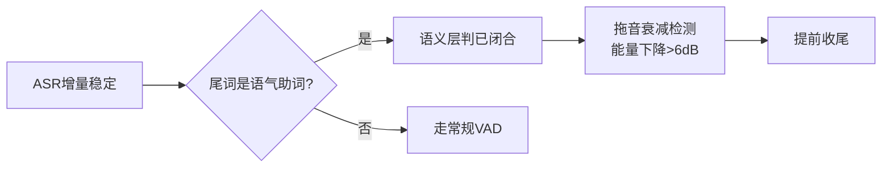
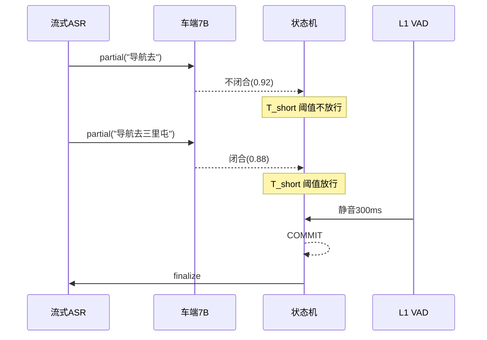
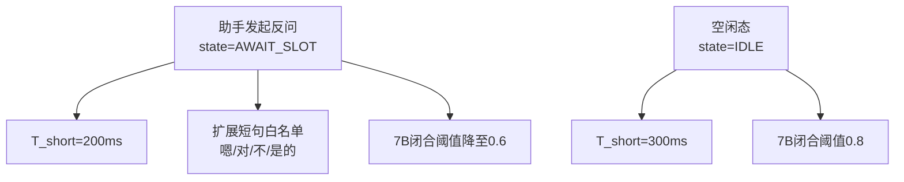
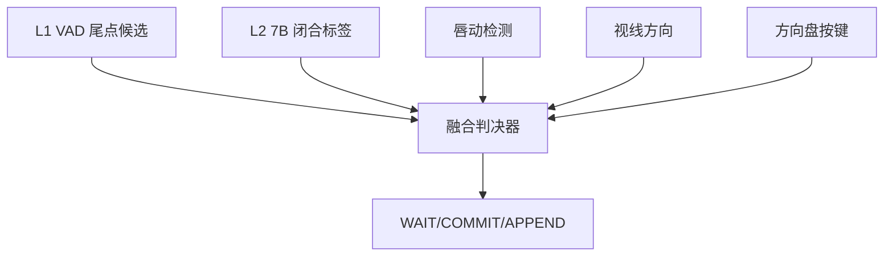
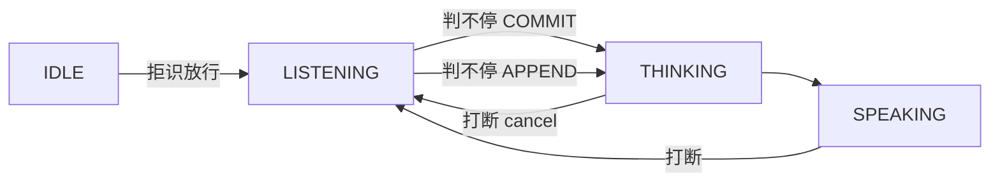
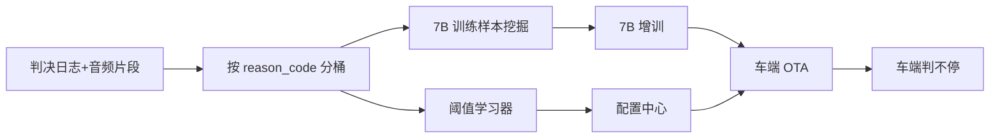

# 判不停能力（Smart Endpointing）

> **判不停**（Endpoint Detection / Smart Endpointing）是指在用户连续说话过程中，判断"这一句到底说完没有、要不要现在送云端 / 现在出回复"的实时判决能力。它**直接决定一次交互的尾点（end-of-utterance, EOU）**：尾点判得太早，用户被截断；判得太晚，用户体感卡顿。
>
> **前置阅读**：判不停与打断、拒识共用同一套感知信号栈、四层判决框架、多音区规则、链路路由、状态机，详见 [交互判决共用骨架](./00-交互判决共用骨架.md)。本文只聚焦判不停**特有**的判决语义：**等 vs 收 vs 续**（继续等、收尾送云端、把后续内容续接到当前 turn）。

---

## 1. 定位与判决目标

### 1.1 判不停解决什么

传统 VAD 仅靠"静音时长"做尾点（如 600ms 静音即判尾），在车机连续对话场景下问题突出：

| 场景 | 传统 VAD 尾点的问题 | 判不停期望行为 |
| --- | --- | --- |
| 用户中途思考停顿（"导航去……嗯……三里屯"） | 600ms 内被截断为两条请求 | 识别到语义未闭合，等到完整 |
| 用户语气拖长（"打开空调——"） | 拖音被当人声，迟迟不判尾 | 语义已闭合 + 拖音衰减，提前收 |
| 多轮追问（"再大一点"） | 短指令被当噪声丢弃 | 上下文已激活，短句也应受理 |
| 命令 + 追加（"导航回家。哦，先去加油站"） | 第一句已送云端，第二句变新轮 | 0.8s 内追加 → 续接到同一 turn |
| 副驾插话 | 主驾尾点被副驾人声拉长 | 用 zone 隔离，互不污染 |

### 1.2 三态判决输出

判不停**不是二元判决**，输出三态：

| 输出 | 含义 | 后续动作 |
| --- | --- | --- |
| **WAIT（等）** | 语义/声学/上下文均提示"还没说完" | 继续累积音频帧，不送云端 |
| **COMMIT（收）** | 已确认尾点，本轮闭合 | ASR finalize → 送云端 / 触发响应 |
| **APPEND（续）** | COMMIT 后短窗内出现新人声且语义连续 | 续接到上一 turn，复用 session 上下文 |

### 1.3 与共用骨架的对应

| 共用骨架要素 | 判不停里的角色 |
| --- | --- |
| L1 声学门控 | 静音时长 + 拖音/SNR 自适应 → 给出基础尾点 |
| L1.5 词表仲裁 | 句末语气词、追加引导词（"还有"/"另外"）作为续接信号 |
| L2 语义仲裁 | 车端 7B 判语义是否闭合 |
| L3 云端兜底 | 多轮上下文判决、Badcase 回流、阈值调优 |
| 多音区 | 每个 zone 独立判尾，互不抢占 |
| 链路路由 | A/B/C 链路落点不同，但判决器共享一份输出 |

### 1.4 设计目标

- **尾点 P95 ≤ 500ms（语义闭合时）**：用户说完就送，不卡顿。
- **错截率 < 2%**：把"还没说完"误判为完成的占比。
- **错等率 < 5%**：把"已经说完"误判为继续的占比（体感慢）。
- **APPEND 接续成功率 > 95%**：1s 内追加内容能正确续接到同一 turn。
- **跨音区 0 干扰**：副驾说话不影响主驾尾点。

---

## 2. VAD 尾点与基础判决（L1 层）

### 2.1 静音时长的两段阈值

车端 DSP 上跑的轻量 VAD 输出帧级人声标签，尾点判决基于"持续静音时长"，但**单一阈值不够用**，采用两段：

| 阈值 | 典型值 | 触发条件 | 输出 |
| --- | --- | --- | --- |
| `T_short` | 300ms | 静音持续到 T_short 且**前缀语义已闭合** | 提前 COMMIT |
| `T_long` | 800ms | 静音持续到 T_long（不论语义） | 兜底 COMMIT |
| `T_append` | 1200ms（COMMIT 后） | COMMIT 后 T_append 内再次开口 | 触发 APPEND 候选 |

**关键**：`T_short` 必须由 L2 语义层"放行"才生效，避免在用户思考停顿时过早收尾。

### 2.2 自适应阈值

阈值不是常量，按场景动态调：

| 因素 | 调整方向 | 原因 |
| --- | --- | --- |
| SNR 低 | 拉长 T_long（800 → 1200ms） | 噪声易触发误判，给更多缓冲 |
| 多轮追问态 | 缩短 T_short（300 → 200ms） | 短指令场景，反应要快 |
| 已激活 KWS 快路径 | 缩短到 150ms | 用户意图明确，无需等 |
| 用户处于 dictation/听写态 | 拉长 T_long 到 1500ms | 用户在打字风格连续输入 |
| 检测到拖音（句末元音延长） | 提前 200ms 收 | 拖音 = 已经说完但音未断 |

### 2.3 拖音与气音处理

车机老人/小孩用户句末常出现拖音、气音、语气助词（"——啊"/"——啦"），帧级 VAD 仍判为人声但语义已结束。处理方式：



### 2.4 不送云端的丢帧策略

L1 在判 WAIT 期间持续累积音频帧，但**不向云端推流**，防止"边说边送"产生半句请求消耗云端算力。云端 ASR 只在 COMMIT 时刻收到完整句段，由 ASR 自身做端点确认（双保险）。

---

## 3. 语义判不停与车端 7B（L2 层）

### 3.1 7B 在判不停中的定位

车端 7B 在判不停里**只承担 L2**，输入是 ASR 流式增量（partial），输出是"语义是否闭合"的 0/1 标签 + 置信度。**不参与 L1 低延迟尾点**（同共用骨架第 3 节，7B 首 token 跑不进 80ms 窗口）。

### 3.2 语义闭合判别维度

| 维度 | 闭合信号 | 不闭合信号 |
| --- | --- | --- |
| 句法 | 完整动宾/主谓宾结构 | 介词/连词/疑问词收尾（"去……"/"还有……"/"为啥……"） |
| 语用 | 已表达完整意图 | 量词/数量未给定（"导航去三个……"） |
| 节律 | 降调/句末停顿模式 | 升调/拖音/重音未落 |
| 槽位 | 关键槽位齐备 | 必填槽位缺失（"打电话给"无收件人） |
| 语气 | 陈述句/祈使句完成 | 语气助词暗示"还有"（"嗯……"） |

7B 的训练数据由"完整句 vs 截断句"的对比对构成，标签从打车/导航/媒体等高频指令日志中半自动挖掘。

### 3.3 流式增量的两次判决

ASR 每输出一段稳定 partial（约 100~200ms 一帧），7B 在车端做一次轻判：



**两次判决**：
- **闭合早判**：T_short 触发前由 7B 给出闭合标签 → 允许提前 COMMIT。
- **续接判别**：COMMIT 后 T_append 内再开口 → 7B 判"新内容是否承接前文"，决定 APPEND 还是新 turn。

### 3.4 7B 与 ASR 的对齐成本

ASR partial 会回退（rewrite），7B 不能每次回退就重判。优化策略：

- partial 稳定 ≥ 200ms 才送 7B。
- 7B 只对增量 token 做增量推理（KV cache 复用）。
- 7B 输出加 hysteresis（迟滞）：上一帧"闭合"→ 这一帧需明确"不闭合"才能切回。

---

## 4. 多轮上下文与对话状态

### 4.1 上下文如何影响判尾

多轮对话里，"还没说完"经常依赖**上一轮的话题**：

| 上一轮 | 本轮当前 partial | 单独看 | 结合上下文 |
| --- | --- | --- | --- |
| 助手刚问"几点？" | "明天" | 不闭合 | 闭合（回答"什么时候"） |
| 助手刚说"找到三个加油站" | "第二个" | 不闭合 | 闭合（指代选择） |
| 用户上轮说"打电话给妈" | "再发个微信说我晚点回来" | 闭合 | 闭合（独立新轮） |
| 用户上轮说"导航回家" | "哦不去公司了" | 不闭合 | 闭合（修正前轮） |

### 4.2 对话状态对判尾的拉动

对话状态机里，"等待用户补槽"态会**主动拉短** T_short：



### 4.3 续接（APPEND）规则

**触发条件**（必须**全部**满足）：

1. 上一 turn COMMIT 后 ≤ T_append（默认 1.2s）。
2. 同一 zone、同一声纹。
3. 7B 判新内容与前文语义连续（修正/补充/追加，而非新意图）。
4. 上一 turn 的云端响应**尚未开始播报 TTS**（已开始播 → 走打断逻辑，不走 APPEND）。

**执行**：

- 取消上一 turn 的云端任务（复用打断的 cancel 协议，但语义不同）。
- 把新 partial 拼接到上一 turn 的请求文本后，重发云端。
- session/turn_id 复用，reply_id 重置。

### 4.4 与"判不停"对应的反向能力——主动催问

判不停判出长时间 WAIT 但用户疑似卡壳（静音 > 2s 且无语义闭合趋势），系统可主动催问"您要去哪里？"。这部分由**对话管理（DM）**触发，判不停只负责输出"长时间 WAIT 信号"作为催问的 trigger。

---

## 5. 多模态信号融合

### 5.1 单点声学的天花板

纯声学 VAD + 语义 7B 在嘈杂车舱中错截率难以低于 2%，需多模态辅助：

| 模态 | 来源 | 在判不停中的作用 |
| --- | --- | --- |
| 视线 | DMS 摄像头 | 主驾视线离开屏幕/方向盘 → 倾向"还在想"，拉长 T_long |
| 唇动 | DMS / OMS | 嘴唇仍在动 → 强信号"未说完"，无视声学静音 |
| 手势 | 手势摄像头 | 手势抬起/比划 → 暗示在描述，拉长 |
| 方向盘按键 | CAN 总线 | 用户长按 PTT → 强制 WAIT；松开 → 立即 COMMIT |
| 仪表/HMI | 系统状态 | 当前在地址输入/电话列表页 → 拉长 T_long，等用户念完 |

### 5.2 融合策略



- **硬否决**：PTT 长按 → 强制 WAIT；唇动持续 → 强制 WAIT。
- **软调权**：视线、手势作为阈值偏置（±100~200ms）。
- **降级路径**：DMS 信号缺失 / 弱光下不可用时，自动回落到声学 + 语义。

### 5.3 隐私与算力约束

- 唇动/视线只在车端运行，不上云，不落原图。
- DMS 算力优先服务于安全（疲劳/分心检测），判不停的多模态接口走低优先级、可被抢占。

---

## 6. 多音区与跨音区规则

### 6.1 zone 内独立判决

每个 zone 拥有独立的判不停状态机（含 T_short / T_long / 7B 上下文），互不共享阈值与上下文。

### 6.2 zone 间互不污染

| 场景 | 规则 |
| --- | --- |
| 主驾说话 + 副驾插话 | 副驾人声不进入主驾 VAD（DOA + 声纹门控），主驾尾点不被拉长 |
| 主驾沉默 + 副驾继续说 | 主驾走自己的 T_long 收尾，与副驾无关 |
| 主驾刚 COMMIT，副驾说话 | 副驾不触发主驾的 APPEND 续接（声纹不一致） |
| 多人同声 | DOA + 声纹分流到各自 zone，独立判尾 |

### 6.3 跨音区共享的只有"算力调度"

7B 在车端是**单实例分时复用**，多 zone 共用一张 NPU。仲裁：

- 主驾任意态 > 副驾 > 后排。
- 同优先级按到达顺序排队。
- 7B 单次推理 < 50ms，排队抖动可控。

### 6.4 副驾上屏场景的判尾差异

副驾通过屏幕文字输出（无 TTS）时，**判不停依然要做**——因为云端要根据完整请求生成回复。但 T_long 可放宽（800 → 1500ms），换更高的语义完整度。

---

## 7. 与打断、拒识的协同

### 7.1 三能力在状态机上的分工



| 状态迁移 | 主导能力 | 协同 |
| --- | --- | --- |
| `IDLE → LISTENING` | 拒识 | 拒识放行后判不停才开始 |
| `LISTENING → THINKING` | **判不停（COMMIT）** | 拒识可在最后一刻撤回 |
| `LISTENING → THINKING`（再次） | **判不停（APPEND）** | 复用 session，不走拒识 |
| `SPEAKING → LISTENING` | 打断 | 进入新 LISTENING 后判不停接管 |
| `THINKING → LISTENING` | 打断 | cancel 当前轮，判不停重启 |

### 7.2 边界协议

| 事件 | 判不停的动作 | 打断的动作 | 拒识的动作 |
| --- | --- | --- | --- |
| 主驾开口（IDLE） | 启动 T_short/T_long 计时 | 不参与 | 判 Addressee |
| 主驾开口（SPEAKING） | **不参与**（先归打断） | fade-out TTS | 不参与 |
| COMMIT 后 1s 内继续说 | 触发 APPEND 候选 | **不**触发打断（无 TTS 在播） | 已通过，不再判 |
| TTS 播报中又开口 | **不参与**（归打断） | 完整四层链路 | 判是否目标说话人 |
| 拒识判定为非主驾 | 立即停 T_short/T_long，丢弃 | 不参与 | 主导 |

### 7.3 共用判决总线

三能力共用同一条事件总线，事件结构：

```json
{
  "event_type": "endpoint",      // barge_in / reject / endpoint
  "sub_type": "wait|commit|append",
  "zone_id": "driver",
  "session_id": "...",
  "turn_id": "...",
  "trigger_source": "vad|nlu|multimodal",
  "confidence": 0.91,
  "timestamp": 1716189123456,
  "reason_code": "semantic_closed_short_silence"
}
```

总线下游同时被打断 / 拒识 / 判不停消费，避免三套逻辑各自重复采集。

### 7.4 优先级冲突仲裁

同一帧上同时来打断与判不停 COMMIT：**打断优先**。原因是用户已经在 SPEAKING 态打断，新一轮的"完成尾点"必须等打断处理完、状态机迁回 LISTENING 才有意义。

---

## 8. 端云分层与延迟预算

### 8.1 四层落点

| 层级 | 位置 | 在判不停里的职责 | 延迟预算 |
| --- | --- | --- | --- |
| **L1 声学** | 车端 DSP | 帧级 VAD + 静音计时 + 拖音检测 | < 80ms |
| **L1.5 词表** | 车端 CPU | 续接引导词、句末语气助词命中 | 50~120ms |
| **L2 语义** | 车端 7B | 闭合判别 + APPEND 连续性判别 | 200~400ms |
| **L3 云端** | 云端 LLM | 多轮上下文判决 + 长尾 case 兜底 + 阈值学习 | 秒级 |

### 8.2 延迟预算分配

```
用户停止说话 (t=0)
├── t=0~80ms:    L1 静音计时启动
├── t=200ms:     7B 闭合判决就位（基于最后一段 partial）
├── t=300ms:     T_short + 7B 闭合 → 提前 COMMIT 路径触发
├── t=500ms:     COMMIT 完成，云端开始处理（P95 目标）
└── t=800ms:     T_long 兜底 COMMIT（语义闭合判别失败时）
```

### 8.3 链路差异

| 链路 | 判不停落点 | 关键差异 |
| --- | --- | --- |
| **A 车端 7B** | L1 + L2 完全闭环 | 不需要送云端，COMMIT 直接进 7B 推理 |
| **B 云端传统** | L1 + L2 → L3 复核 | COMMIT 后云端 ASR finalize 再做一次端点确认 |
| **C 云端 S2S** | L1 兜底 + S2S 内部判尾 | 车端不再做语义判尾，仅保留 L1 防止 S2S 死等 |

### 8.4 不阻塞的串并行

- L1 与 L2 **并行运行**：L1 可独立给出 T_long 兜底，不依赖 L2。
- L2 与 L1 **互相确认**：L2 闭合 + L1 静音 ≥ T_short → 提前 COMMIT。
- L3 **不在主链路**：只走异步回流，不阻塞当前 turn。

### 8.5 弱网与降级

- 弱网链路 B 时延 > 2s → 自动降级到链路 A 完成本轮，避免用户等待。
- 链路 C 心跳超时 → 立即切回链路 B + L1 兜底。

---

## 9. 评测体系与 Badcase

### 9.1 核心指标

| 指标 | 定义 | 目标 |
| --- | --- | --- |
| 错截率 | 应等却被 COMMIT 的占比 | < 2% |
| 错等率 | 应 COMMIT 却仍在 WAIT 的占比 | < 5% |
| 尾点 P95 时延 | 用户停止说话 → COMMIT | ≤ 500ms（语义闭合时） |
| 尾点 P95 时延（兜底） | 同上，T_long 触发 | ≤ 800ms |
| APPEND 接续成功率 | 1s 内追加被正确续接的占比 | > 95% |
| APPEND 误触率 | 不该续接被续接的占比 | < 1% |
| 跨音区污染率 | 副驾人声拉长主驾尾点的占比 | < 0.1% |
| 语义闭合判别 F1 | 7B 闭合 vs 不闭合 | > 0.92 |

### 9.2 测试集维度

| 维度 | 样本类型 |
| --- | --- |
| 流畅度 | 流畅 / 中断停顿 / 卡壳重说 / 拖音 |
| 语速 | 极快 / 正常 / 极慢 / 老人 / 儿童 |
| 句式 | 完整祈使 / 短指令 / 多槽位 / 含连词的复合句 |
| 噪声 | 静音 / 路噪 / 风噪 / 音乐 / 多人对话 |
| 多轮 | 单轮 / 反问补槽 / 修正前轮 / 1s 内追加 |
| 多音区 | 单 zone / 主副同说 / 后排干扰 |
| 多模态 | 有 DMS / 无 DMS / DMS 弱光降级 |

### 9.3 常见 Badcase 与对策

| Badcase | 根因 | 对策 |
| --- | --- | --- |
| 用户思考停顿被截断 | T_short 过短 + 7B 未发挥作用 | 训练 7B "不闭合"信号，T_short 必须 7B 放行才生效 |
| 老人拖音迟迟不收 | 帧级 VAD 一直判人声 | 拖音检测（能量衰减 + 元音延长）→ 提前 200ms 收 |
| "嗯……"被当独立请求 | 拒识漏过 + 判不停立即 COMMIT | 拒识黑名单 + 判不停短句保护：< 3 token 必须语义闭合 |
| APPEND 被误判为新轮 | 7B 连续性判别弱 | 上一 turn 上下文显式喂给 7B，不仅看本轮文本 |
| 副驾说话拉长主驾尾点 | DOA/声纹门控失效 | L1 严格按 zone 隔离，不进入主驾累积 |
| "导航去——三里屯"中间停 1s 被拆 | T_long 兜底过早 | 检测到拖音/降调缺失 → 自动延长 T_long |
| 反问"几点？"用户答"明天"被判太短 | 多轮态阈值未生效 | DM 显式下发 `state=AWAIT_SLOT`，缩 T_short + 降闭合阈值 |
| 命令音箱播放歌词被当人声 | 音乐被识别为人声 | 歌声/音乐判别 + 播放音乐时 T_long ↑ |
| PTT 松开瞬间漏字 | PTT 松开即收，最后一帧未抓 | PTT 松开后再保留 200ms 缓冲帧 |
| S2S 内部死等 | 车端 L1 兜底未生效 | 即使链路 C，车端 T_long 必须保留作为安全网 |

### 9.4 Badcase 回流闭环



- **样本回流**：误截 / 误等的音频 + ASR + 上下文打包，离线挖掘。
- **阈值学习**：T_short / T_long / 7B 阈值按车型、车机、时段分群学习。
- **个性化**：长期可按声纹学习个人语速/习惯停顿（与打断个性化共用画像）。

---

## 10. 演进方向

1. **判决中枢统一**：长期看，打断 / 拒识 / 判不停 合入同一个"交互判决引擎"，输出多维决策（take / reject / interrupt / wait / commit / append）。
2. **S2S 原生判尾**：链路 C 扩容后，模型内部基于 audio token 流原生判尾，车端 L1 仅保留极端兜底。
3. **多模态深融合**：唇动 + 视线 + 手势从"软调权"升级到"主输入之一"，错截率目标 < 1%。
4. **个性化判尾画像**：声纹绑定的个人语速/停顿习惯，长期下放到车端 7B 的 prompt / adapter。
5. **DM 主导的预测式判尾**：基于槽位填充进度主动预测"还要说什么"，配合催问，降低用户卡壳成本。
6. **跨能力数据共用**：打断 / 拒识 / 判不停的 Badcase、阈值学习、声纹画像走同一个挖掘 Pipeline，避免三套数据管线重复建设。

---

## 关键决策汇总（一张表）

| 决策点 | 结论 |
| --- | --- |
| 判决输出 | 三态 WAIT / COMMIT / APPEND |
| 阈值结构 | T_short（语义放行） + T_long（兜底） + T_append（续接窗） |
| 7B 定位 | L2 语义闭合判别，**不**承担 L1 |
| ASR 推流时机 | 仅 COMMIT 时 finalize 送云端，不边说边送 |
| 上下文影响 | DM 状态显式下发阈值偏置 |
| 多模态 | DMS 唇动/视线作为软调权 + PTT 硬否决 |
| 多音区 | 每 zone 独立计时与 7B 上下文，互不污染 |
| 链路差异 | A 全闭环 / B 云端 ASR 复核 / C S2S 内部判尾 + L1 兜底 |
| 与打断协同 | 同帧冲突时打断优先 |
| 与拒识协同 | 拒识放行后判不停启动；APPEND 不再走拒识 |

---

## 参考与延伸

- [交互判决共用骨架](./00-交互判决共用骨架.md)
- [打断能力（Barge-in）](./01-打断能力.md)
- [拒识能力（Rejection）](./02-拒识能力.md)
- [豆包实时语音架构](../../doubao_realtime_voice/README.md)
- [半端到端架构详解](../../doubao_realtime_voice/05-半端到端架构详解.md)
- [车机语音助手后端架构演进展望](../../xp_project/车机语音助手后端架构演进展望.md)
