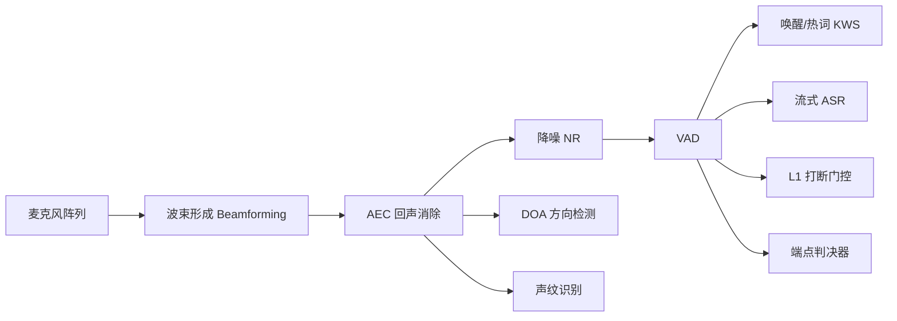
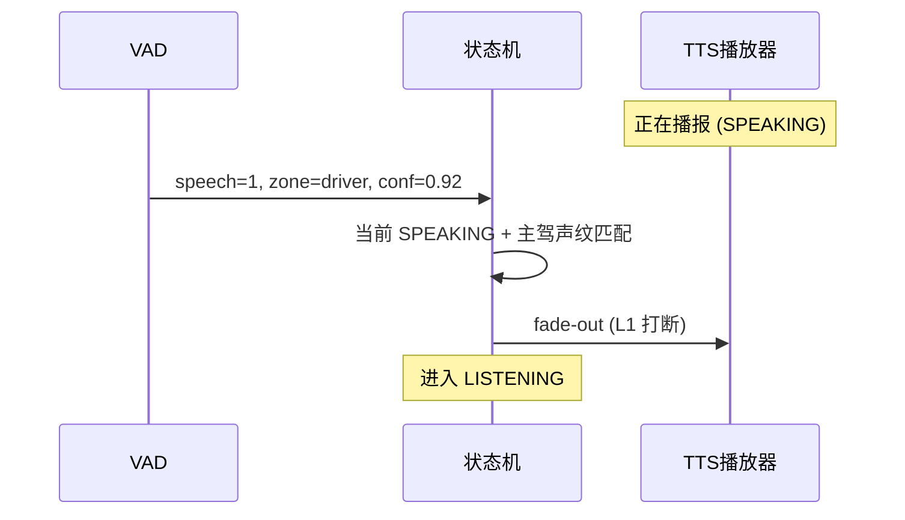
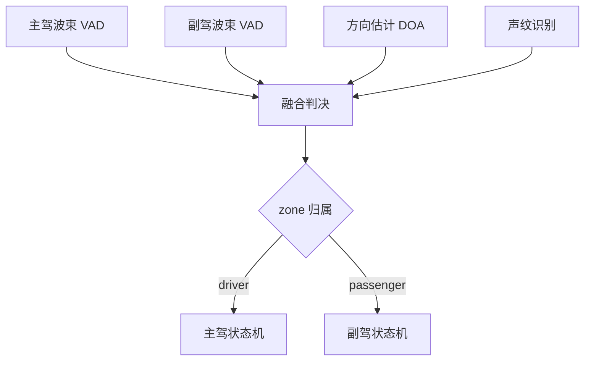
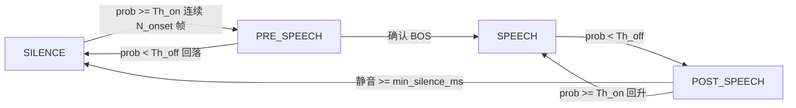
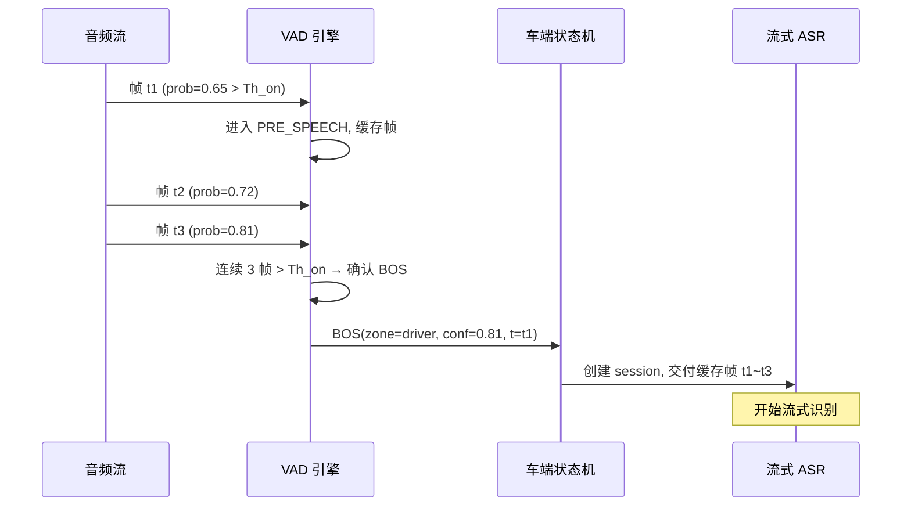
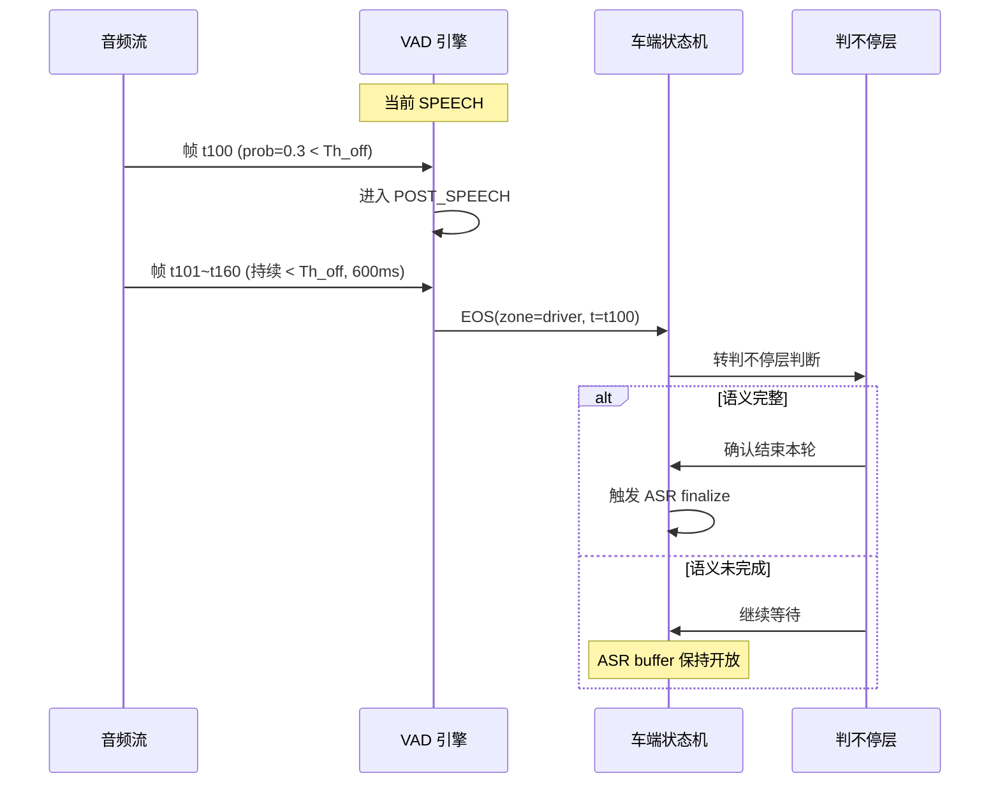
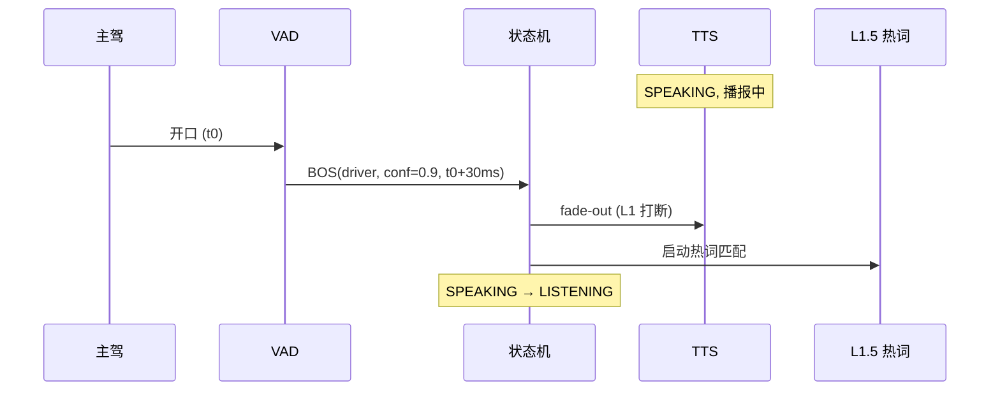

# VAD（Voice Activity Detection，语音活性检测）

> VAD 是车机语音链路的**前端门控层**：负责判断"有没有人说话"、"从哪里开始 / 哪里结束"，为下游的打断、拒识、判不停、ASR、KWS 提供共享的声学感知信号。它并不负责"说了什么"，但确定"是否有人说"和"什么时候说完"。本文聚焦**车端 VAD**，即部署在车机本地的实时语音活性检测。
>
> **前置阅读**：与打断、拒识、判不停共用的感知栈与多音区规则见 [交互判决共用骨架](./00-交互判决共用骨架.md)。

---

## 1. 设计目标与核心原则

### 1.1 目标

- **起点响应 ≤ 30ms（帧级）**：用户一开口，VAD 必须在 1~2 帧内输出 speech=1，不能制约下游 L1 打断的 300ms 时间预算。
- **终点误差 ≤ 200ms**：语音真实结束点与 VAD 判出 EOS 的时差（不含静音窗），影响 ASR 最后一个字的完整性和判不停的判定时机。
- **误触率 FA < 2%**：非人声（路噪、音乐、AEC 残留）被误判为 speech 的比例，直接影响打断误触和 ASR 负载。
- **漏检率 FR < 1%**：用户真实说话被漏检的比例，直接导致唤醒失败、打断失灵、ASR 丢字。
- **多音区独立**：每个 zone 独立输出 VAD 状态，不能因副驾开口而干扰主驾的判断。
- **全场景可用**：从地下车库到高速 120km/h，从安静停车到打开车窗，均要稳定工作。
- **离线可用**：不依赖网络，车端独立完成所有 VAD 判决。

### 1.2 核心原则

1. **宁可多认，不可漏认**：VAD 下游还有 ASR、拒识、L2 语义层进一步过滤，但 VAD 漏了就彻底丢了。
2. **帧级流式、不回看**：车端算力限制，不能缓存几秒音频回头看，必须逐帧流式决策。
3. **与 AEC 紧耦**：VAD 的输入必须是 AEC 后的信号，否则 TTS 自播音必然误触。
4. **参数可调、场景可切**：不同场景（播报中 / 音乐中 / 通话中）需要不同的阈值组合。
5. **算力极简**：常驻运行，功耗 < 50mW，不能抢占 ASR/7B 等下游模块的算力。

### 1.3 关键术语与边界

| 术语 | 定义 | 输出 | 与 VAD 关系 |
| --- | --- | --- | --- |
| **VAD** | 判断当前帧是否存在人声（speech / non-speech） | 帧级 0/1 + 置信度 | 本文核心 |
| **SED**（声音事件检测） | 判断当前帧属于哪类声音事件（咳嗽、小孩哭、喇叭等） | 事件类别 + 置信度 | VAD 的超集；VAD 只关心"是不是人说话" |
| **端点检测**（Endpointing） | 判断一段语音的起始点（BOS）和结束点（EOS） | 时间戳 | VAD 的直接下游，把帧级信号聚合成"开始/结束"事件 |
| **静音检测**（Silence Detection） | 纯能量判断，信号能量低于门限 | 0/1 | 最原始的 VAD；工程中常作为极快速判断的第一层 |

---

## 2. 整体架构总览

### 2.1 在车机语音链路中的位置

**关键位置**：VAD 位于 AEC + 降噪之后、ASR/KWS/打断之前。它是下游所有语音智能模块的"网关"——VAD=0 时下游模块不需要工作，节省算力与功耗。

### 2.2 与上下游模块的关系

| 模块 | 与 VAD 的关系 | 数据流向 |
| --- | --- | --- |
| **AEC** | VAD 的前置依赖。AEC 不干净，自播音残留必然导致 VAD 误触 | AEC → VAD |
| **波束/DOA** | 多音区场景下，每路波束独立跑 VAD；DOA 结果辅助 zone_id 归属 | BF → VAD×N / DOA → zone_id |
| **声纹** | 与 VAD 并行。声纹确认"谁在说"，VAD 确认"有人在说"，联合打 zone_id 标 | 并行融合 |
| **KWS** | VAD=1 是 KWS 启动的前提（或放宽阈值），节省空跑算力 | VAD → 门控 KWS |
| **ASR** | VAD BOS 触发 ASR session 创建，VAD EOS 触发 ASR finalize | VAD → 控制 ASR 生命周期 |
| **打断** | VAD=1 + 主驾声纹 + 主驾 DOA → 触发 L1 fade-out | VAD → L1 打断 |
| **判不停** | EOS 的误判直接导致话说一半被截；VAD 终点 hangover 与判不停层联动 | VAD EOS → 判不停层二次确认 |

---

## 3. 算法分层与技术选型

### 3.1 能量类 VAD（短时能量 / 过零率）

**原理**：计算每帧短时能量（STE）和过零率（ZCR），超过自适应阈值判为 speech。

- **优点**：计算量极小（DSP 就能跑）、延迟极低（< 5ms）、零训练。
- **缺点**：对稳态噪声（路噪、风噪）极度敏感，误触率高。
- **车载定位**：作为"最快速第一层"，结合下游 DNN VAD 做二次确认（先用能量拉起候选，再用神经网络确认）。

### 3.2 统计类 VAD（GMM / WebRTC VAD）

**原理**：用 GMM 建模噪声和语音的分布，用似然比做判决。WebRTC VAD 是 Google 开源的经典实现，支持 10/20/30ms 帧长，4 个激进级别。

- **优点**：算力极低（纯 CPU）、无训练依赖、工业级稳定。
- **缺点**：对非平稳噪声（音乐、广播人声、歌声）辨别力弱；低 SNR 下 FR 升高。
- **车载定位**：低算力场景的主力方案（尤其老车型无 NPU）；也可作为 DNN 方案的降级通路。

### 3.3 DNN / RNN VAD（CRNN、TCN、Conformer-VAD）

**原理**：用神经网络对 fbank/log-mel 特征做帧级二分类。主流架构：

| 架构 | 特点 | 参数量 | 车端适用 |
| --- | --- | --- | --- |
| **CRNN** | CNN 提特征 + GRU/LSTM 建模时序 | 50K~200K | 主力方案 |
| **TCN** | 因果卷积，并行度高，易量化 | 100K~500K | 主力备选 |
| **Conformer-VAD** | Attention + Conv，精度最高 | 500K~2M | 高算力车端/未来方向 |

- **优点**：噪声鲁棒性强、能区分人声/音乐/噪声、可根据场景微调。
- **缺点**：需要训练数据；需做量化/剪枝确保实时性。
- **车载定位**：车端主力方案。CRNN/TCN（INT8 量化，NPU/DSP 部署）。

### 3.4 端到端联合建模（VAD + KWS / VAD + ASR）

**思路**：将 VAD 作为 ASR/KWS 模型的子任务，共享 encoder，在中间层加 speech/non-speech 分支头。

- **优点**：参数复用，减少总算力；语义信息反向增强 VAD 判断。
- **缺点**：耦合度高，无法单独迭代 VAD；模型体积偏大。
- **车载定位**：潜力方向，目前主流仍是独立 VAD + 独立 ASR。

### 3.5 多模态 VAD（视觉唇动 / 红外 / 方向盘按键辅助）

- **视觉唇动**：车内摄像头检测唇部动作，极端噪声下辅助确认"有人在说话"。延迟 30~50ms，只能做"确认"不能做"触发"。
- **红外探测**：检测座位是否有人，无人座位的 VAD 事件直接丢弃。
- **方向盘按键 / 触屏**：物理按键作为"强制 BOS"，绕过 VAD 直接开启语音链路，解决极端噪声下 VAD 失灵。
- **定位**：辅助增强，不替代主声学 VAD。

### 3.6 选型对比表

| 方案 | FA (%) | FR (%) | 延迟 | 算力（MFLOPS） | 噪声鲁棒性 | 车端适用 |
| --- | --- | --- | --- | --- | --- | --- |
| 能量/ZCR | 8~15 | 3~5 | < 5ms | ~0 | ★☆☆☆☆ | 仅作快速预判 |
| WebRTC VAD | 3~5 | 1~3 | 10~30ms | < 0.1 | ★★☆☆☆ | 低算力主力/降级 |
| CRNN (INT8) | 1~2 | 0.5~1 | 10~20ms | 1~5 | ★★★★☆ | **车端主力** |
| TCN (INT8) | 1~2 | 0.5~1 | 10~20ms | 2~8 | ★★★★☆ | 车端主力备选 |
| 联合建模 | 0.3~0.8 | 0.2~0.5 | 30~80ms | 随 ASR | ★★★★★ | 未来方向 |

---

## 4. 端点检测（Endpointing）

### 4.1 起点检测（Speech Onset）与首包延迟

**逻辑**：连续 `N_onset` 帧（典型 2~3 帧，20~30ms）被判为 speech → 触发 BOS 事件。

- **N_onset 太小**：咳嗽、啭嘴等短脉冲误触发 BOS。
- **N_onset 太大**：BOS 延迟增大，制约打断的 L1 响应时间。
- **车载经验**：设 2~3 帧（20~30ms），配合主驾声纹确认后即触发 L1。

首包延迟 = `帧长 × N_onset + VAD 推理时间 + 事件上报延迟`，目标 ≤ 50ms。

### 4.2 终点检测（Speech Offset）与尾点静音窗

**逻辑**：speech 结束后，连续静音超过 `min_silence_ms`（静音窗）→ 触发 EOS 事件。

- **静音窗太短（< 400ms）**：用户思考停顿被误判为结束，话说一半被截断。
- **静音窗太长（> 1200ms）**：响应慢，用户感知"说完了怎么还不理我"。
- **车载经验**：默认 600~800ms，导航场景拉宽到 700~900ms，车控快指令缩短到 400~500ms。

### 4.3 自适应静音阈值

固定静音窗无法覆盖所有用户：

- **快语速用户**：停顿 300ms 就可能是结束，窗口应缩短。
- **慢语速 / 思考型用户**："喔…我想去…那个…"，停顿 800ms 也不一定是结束。

**自适应策略**：
1. **用户级学习**：按用户历史语速 P95 学习"典型停顿时长"，动态调整 EOS 窗口。
2. **语义反馈**：流式 NLU 检测到未完成结构（缺宾语、缺地点）时，临时拉长静音窗。
3. **场景联动**：当前在导航场景、用户语速偏慢 → 自动拉宽。

### 4.4 与判不停的协同

**问题**：VAD 判出 EOS 后，是彻底结束本轮还是继续等待（判不停）？

- VAD 的 EOS 只是"当前一段语音结束"，不等于"本轮对话结束"。
- 判不停层在 EOS 后开始计时：在一定窗口内结合语义完整性判断是否真正结束。
- **协同机制**：
  - VAD EOS → 通知判不停层"用户停了"
  - 判不停层判断语义完整性、是否进入新轮、或继续等待
  - 若判不停层决定继续等，则不触发 ASR finalize，语音输入 buffer 保持开放

### 4.5 与打断的协同（VAD=1 即触发 L1 fade-out）

**解耦原则**：VAD 只负责输出"有人说话"，是否打断由下游状态机确定。

关键点：
- VAD=1 **不等于打断**。只有在 SPEAKING/THINKING 状态且声纹/DOA 确认主驾时才触发。
- VAD=1 在 IDLE 状态 → 可能触发唤醒检测，而非打断。
- VAD=1 在副驾 zone → 不影响主驾 TTS。

---

## 5. 噪声鲁棒性与车载特殊场景

### 5.1 路噪 / 风噪 / 胎噪

| 噪声类型 | 特征 | 对 VAD 影响 | 应对策略 |
| --- | --- | --- | --- |
| **路噪** | 低频为主、较平稳，跟车速正相关 | 能量类 VAD 大量误触 | 车速信号联动：车速越高，阈值自动拉高 |
| **风噪** | 宽频突发、与车窗状态关联 | DNN VAD 也可能误触 | 车窗状态联动：开窗时自动拉高阈值 + 波束增强 |
| **胎噪** | 低频持续、较稳 | 对 DNN VAD 影响小 | 预处理阶段高通滤波即可 |

**关键实践**：通过 CAN 总线获取车速、车窗状态、空调档位等车身信号，作为 VAD 的"场景上下文"输入，动态调整阈值。

### 5.2 车内音乐 / 广播 / 导航播报（自播音）

**这是 VAD 最大的敌人**：音乐和广播中的人声，在声学特征上与用户语音极度相似。

| 场景 | 难点 | 应对 |
| --- | --- | --- |
| **音乐中的歌声** | 人声 + 旋律，和用户说话极像 | AEC 是第一防线；残留后用"音乐/语音"二分类器补刀 |
| **广播播音员** | 纯人声，AEC 消不干净就彻底乱 | AEC 参考信号对齐 + 播报时段标记为"不可信区" |
| **导航/TTS 自播音** | 系统自己生成的音频 | AEC 参考信号精确对齐（延迟补偿）；标记 TTS 时段降权 |

**核心原则**：**AEC 是第一防线**。VAD 永远假设输入已经 AEC 处理过，但要对 AEC 残留有容忍度。

### 5.3 多人同时说话 / 儿童哭闹 / 宠物声

- **多人同时说话**：VAD 只判"有人说"，不判"谁说"。多人同说时 VAD=1 永远为真，由声纹 + DOA 决定归属哪个 zone。
- **儿童哭闹**：高频 + 非语言，DNN VAD 应能区分。训练数据中需包含车内儿童哭闹样本作为负例。
- **宠物声**：狗叫、猫叫等脉冲性强，可能短暂误触能量类 VAD，DNN VAD 应能过滤。

### 5.4 空调 / 雨刮 / 喇叭 / 转向灯等机械噪声

| 噪声源 | 特征 | 处理 |
| --- | --- | --- |
| 空调风噪 | 低频稳态，开关可感知 | CAN 总线感知空调档位，开启时拉高阈值 |
| 雨刮 | 周期性脉冲，能量中等 | 周期性检测 + 阈值拉高 |
| 喇叭 | 短暴发，能量极高 | 喇叭开关信号联动，短时拉高阈值 |
| 转向灯哚哚声 | 周期脉冲 | min_speech_ms 设合理即可过滤 |

### 5.5 与 AEC 残留回声、双讲场景的处理

**双讲（Double-talk）**：用户和 TTS 同时出声，正是打断的核心场景。

- AEC 在双讲时效果急剧下降，会有显著残留。
- VAD 必须在残留回声中仍能检测到用户语音 → 这是 DNN VAD 的核心优势。
- **工程实践**：
  1. AEC 输出的 ERLE（回声抑制比）作为 VAD 的辅助输入：ERLE 低时，VAD 阈值适当拉高。
  2. 训练数据中必须包含大量双讲场景（用户说话 + TTS 播报 + AEC 残留）。
  3. 残留回声被判为 speech 时，由声纹层最终过滤（属于系统自己的声纹，丢弃）。

---

## 6. 多音区独立 VAD

### 6.1 每路波束独立 VAD

**车载选择**：每路波束独立跑一个 VAD 实例（主流方案）。

原因：
- 车端麦克风阵列一般 4~8 mic，波束打向主驾/副驾/后排，每路已有空间选择性。
- 独立 VAD 保证主驾 zone 的判断不受副驾干扰，是多音区独立会话的基础。
- 代价：算力×N（N 路波束），但 CRNN/TCN 足够轻量可接受。

### 6.2 DOA + 声纹辅助的 zone 归属判定

**融合逻辑**（优先级：声纹 > DOA > 波束）：
1. 波束 VAD=1 → 主候选该波束对应的 zone。
2. DOA 角度 → 确认或推翻（波束侧瓣泄漏时，DOA 与波束方向不一致，取 DOA）。
3. 声纹 → 最终确认。已注册声纹匹配主驾，则归主驾 zone。

### 6.3 跨音区仲裁规则

与打断能力文档的跨音区规则对齐：

| 场景 | 规则 |
| --- | --- |
| 主驾和副驾同时 VAD=1 | 主驾优先建 session，副驾入队 |
| 副驾 VAD=1，主驾 TTS 播报中 | 不打断主驾，副驾走耳机/屏幕 |
| 后排 VAD=1，主驾 IDLE | 后排正常建 session |
| 多 zone 同时 VAD=1，输出通道冲突 | Arbiter 仲裁，主驾优先占扬声器 |

### 6.4 主驾优先与非主驾门控阈值差异

- **主驾**：阈值最敏感（speech_threshold 偏低），宁可误触也不可漏检。
- **副驾**：阈值适中，避免主驾说话时副驾波束侧瓣泄漏导致误触。
- **后排**：阈值最高，可配置"后排默认关闭"，需用户主动开启。

**安全规则**：强打断词（"停"/"闭嘴"）的 VAD 只认主驾 zone，非主驾说这些词只能打断自己的 session。

---

## 7. 阈值与参数调优

### 7.1 触发阈值 / 释放阈值 / 滞回设计

**滞回（Hysteresis）原理**：用不同阈值控制"进入 speech"和"离开 speech"，避免边界频繁跳变。

| 参数 | 含义 | 典型值 |
| --- | --- | --- |
| `Th_on`（触发阈值） | 概率超过此值判为 speech | 0.5~0.6 |
| `Th_off`（释放阈值） | 概率低于此值判为 silence | 0.3~0.4 |
| 滞回区间 | Th_on - Th_off | 0.1~0.2 |

滞回区间越大，状态越稳定，但起点/终点认定会偏慢。

### 7.2 起点 hangover / 终点 hangover

| 类型 | 含义 | 作用 | 典型值 |
| --- | --- | --- | --- |
| **起点 hangover** | BOS 前向回捕获 N 帧 | 保证语音第一个音节不丢（"喔"字开头） | 2~5 帧（20~50ms） |
| **终点 hangover** | EOS 判定前额外延伸 N 帧 | 避免末尾轻声/助词被切（"吗"、"噢"） | 5~10 帧（50~100ms） |

**工程注意**：起点 hangover 需要音频 buffer（开始就缓存少量帧），BOS 时把缓存帧一并交给 ASR。

### 7.3 场景化阈值

| 场景 | speech_threshold | min_silence_ms | min_speech_ms | 设计原因 |
| --- | --- | --- | --- | --- |
| 默认（停车/低速） | 0.5 | 600 | 150 | 平衡基准 |
| 导航/高速驾驶 | 0.55 | 800 | 200 | 允许更长思考，抵抗风噪 |
| 播放音乐 | 0.6 | 600 | 200 | 拉高阈值抵抗歌声 AEC 残留 |
| TTS 播报中 | 0.55 | 500 | 120 | 稍微拉高抵抗自播音，但保持打断敏感 |
| 车控快指令 | 0.45 | 400 | 100 | 追求最快响应 |
| 电话通话 | 0.5 | 700 | 150 | 正常对话节奏 |

场景切换由车端状态机感知（当前在播音乐 / 正在导航 / TTS 播报中），自动加载对应参数组。

### 7.4 个性化阈值

- **语速学习**：累计用户历史语音段的平均语速和停顿时长 P95，自动调整 EOS 窗口。
- **打断习惯**：用户经常在播报前 2s 就打断 → 对响应速度敏感，可适当降低 BOS 阈值。
- **存储粒度**：车机级（不区分用户，全车共享），简化实现、冷启动可用。

### 7.5 反馈闭环

- 离线分析重点：过早截断率、误触率、打断与 VAD 的联动时序。
- 模型微调：用车载实录噪声场景做增量训练。
- OTA 下发：按车型 × 场景分组灰度，避免全量翻车。

---

## 8. 性能与资源

### 8.1 算力预算

| 部署位置 | 硬件 | 适用模型 | 典型推理时间/帧 |
| --- | --- | --- | --- |
| **DSP** | 专用音频 DSP（ADI / TI） | 能量/WebRTC VAD | < 1ms |
| **CPU** | A 核 ARM | WebRTC / 小 CRNN | 2~5ms |
| **NPU** | 车载 NPU（高通/地平线） | CRNN / TCN (INT8) | 1~3ms |

选型原则：
- 优先用 NPU（算力充裕且不占 CPU）。
- 若无 NPU，用 DSP 跑能量/WebRTC VAD，CPU 跑 CRNN 补刀。
- 多音区 4 路波束 = 4 个 VAD 实例，总算力×4。

### 8.2 内存与功耗约束

| 约束 | 目标 | 说明 |
| --- | --- | --- |
| 模型大小 | < 500KB (INT8) | 包含权重 + 运行时 buffer |
| 工作内存 | < 200KB | 帧 buffer + 特征缓存 + 状态 |
| 待机功耗 | 近零 | VAD 常驻运行，必须低功耗 |
| 活跃功耗 | < 50mW | 包含 DSP/NPU 推理电耗 |

### 8.3 流式实时性

| 参数 | 典型值 | 影响 |
| --- | --- | --- |
| **帧长** | 10~30ms（20ms 最常见） | 帧长越短延迟越低，但计算量增加 |
| **帧移** | 10ms（50% overlap） | 提高时间分辨率 |
| **look-ahead** | 0（因果约束） | 车端不允许未来帧，保证流式 |

**实时性约束**：推理时间 < 帧移。10ms 帧移 → 每 10ms 必须完成一次推理。

### 8.4 模型压缩

| 技术 | 效果 | 车载应用 |
| --- | --- | --- |
| **INT8 量化** | 体积 ~1/4，速度 2~4× | NPU 部署标配，精度损失 < 0.5% FA |
| **知识蒸馏** | 大模型指导小模型 | 小模型精度接近大模型 |
| **结构化剪枝** | 移除冗余 channel/layer | 进一步压缩 10~30% |

---

## 9. 状态机与典型时序

### 9.1 VAD 状态机

| 状态 | 含义 | 对外输出 |
| --- | --- | --- |
| **SILENCE** | 无人说话 | VAD=0，下游休眠 |
| **PRE_SPEECH** | 疑似开口，等待 hangover 确认 | 不对外，内部缓存音频帧 |
| **SPEECH** | 确认有人说话 | VAD=1，触发 BOS |
| **POST_SPEECH** | 语音可能结束，等待静音窗 | 维持 VAD=1（hangover），直到 EOS |

### 9.2 起点触发时序

### 9.3 终点判决时序

### 9.4 打断场景时序

---

## 10. 评测指标

### 10.1 核心指标

| 指标 | 定义 | 目标 |
| --- | --- | --- |
| **FA（False Alarm）** | 非人声被判为 speech 的帧占比 | < 2% |
| **FR（False Rejection）** | 人声被判为 non-speech 的帧占比 | < 1% |
| **BOS 延迟** | 用户真实开口 → VAD 输出 BOS 的时差 | P95 ≤ 50ms |
| **EOS 净延迟** | EOS 延迟 - min_silence_ms | P95 ≤ 200ms |

### 10.2 下游联合指标

| 指标 | VAD 如何影响 | 目标 |
| --- | --- | --- |
| **ASR WER 增量** | BOS 过晚丢首字；EOS 过早丢尾字 | 因 VAD 引入的 WER < 0.5% |
| **打断响应 P95** | VAD BOS 延迟是 L1 打断时延的主要成分 | ≤ 300ms |
| **判不停误截断率** | EOS 过早导致话说一半被截 | < 3% |
| **空跑 session 占比** | FA 导致建立无效 ASR session | < 5% |

### 10.3 测试集建设

| 类别 | 内容 | 规模建议 |
| --- | --- | --- |
| **正样本** | 主驾语音（各噪声条件下） | > 50h |
| **负样本—噪声** | 路噪/风噪/空调/雨刮/喇叭 | > 30h |
| **负样本—自播音** | 音乐歌声、广播人声、TTS | > 20h |
| **负样本—非语音人声** | 咳嗽、叹气、儿童哭闹、狗叫 | > 10h |
| **多音区** | 主副驾同时说话、后排干扰 | > 10h |
| **长尾** | 方言、极快/极慢语速 | > 5h |

---

## 11. 常见 Badcase 与对策

| Badcase | 根因 | 对策 |
| --- | --- | --- |
| 自播音被当人声 | AEC 参考信号延迟未对齐 / 扬声器非线性 | 精确延迟补偿 + 非线性 AEC + TTS 时段降权 |
| 路噪/风噪误触 | 高速场景训练数据不足 | 车速/车窗 CAN 联动拉高阈值 + 补充数据 |
| 短词/单字漏检 | min_speech_ms 过大 / N_onset 过大 | 车控场景降到 80~100ms / N_onset=2 帧 |
| 长停顿被误判为结束 | min_silence_ms 过短 | 场景化拉长 + 语义 hangover |
| 副驾误触主驾 VAD | 波束侧瓣泄漏 | DOA + 声纹联合过滤 |
| 歌声/广播误判 | AEC 残留 + 缺乏音乐负例 | "音乐/语音"二分类器 + 播报时段标记 |
| 咳嗽误触 | 短脉冲能量高 | DNN VAD 训练数据加咳嗽负例 + min_speech_ms 过滤 |
| 开窗瞬间风声 | 宽频突发 | 车窗信号联动 + 瞬态检测 |

---

## 12. 演进方向

### 12.1 多模态 VAD

- **视觉唇动**：极端噪声下辅助确认，延迟 30~50ms，做"确认"不做"触发"。
- **视线感知**：看向屏幕降低阈值，看向车外拉高，减少误触。
- **手势/轻触**：方向盘按键演进为轻触/手势，降低交互成本。

### 12.2 端到端模型内嵌 VAD

- 车端 7B 模型未来可能内嵌 VAD 感知能力，在语义层直接判定"用户是否在说话"。
- 当前现实：7B 首 token 延迟 150~400ms，跑不进 VAD 的帧级预算（≤30ms）。
- 演进路径：VAD 保持独立快速通路，7B 仅做 L2 语义仲裁。

### 12.3 个性化与场景自适应

- 在线学习：用户越用越懂，推断语速、停顿习惯。
- 场景自识别：CAN 总线 + 车身状态自动判断，零手动切换。
- 终极目标："零配置"——出厂后自动收敛到最佳参数。

### 12.4 与 SED 融合

- 升级为 SED：不仅判"有人说"，还判"是咳嗽/叹气/小孩哭/狗叫"。
- 共享模型：VAD + SED 共享 encoder，只加多分类头，算力增量极小。
- 场景价值：检测到小孩哭 → 提醒驾驶员；检测到咳嗽 → 不触发语音助手。

---

## 13. 关键决策汇总

| 决策点 | 结论 |
| --- | --- |
| 主力算法 | CRNN/TCN (INT8)，NPU 部署；WebRTC VAD 作为降级通路 |
| 部署位置 | NPU 优先，无 NPU 则 DSP + CPU 双层 |
| 多音区 | 每路波束独立 VAD，DOA + 声纹确认 zone |
| 主驾规则 | 主驾阈值最敏感、强打断词仅主驾 zone 生效 |
| 阈值策略 | 场景化参数组 + CAN 总线联动（车速/车窗/空调） |
| 终点窗口 | 默认 600~800ms，场景/语义/个性化三层动态调整 |
| 滞回设计 | Th_on=0.5~0.6 / Th_off=0.3~0.4 |
| 个性化粒度 | 车机级共享，简化实现、冷启动可用 |
| 与打断 | VAD=1 + 主驾确认 → L1 fade-out，VAD 不等于打断 |
| 与判不停 | EOS 只是"一段结束"，是否结束本轮由判不停层决定 |
| 与 ASR | BOS 创建 session，EOS 触发 finalize（或由判不停层延迟） |
| 离线能力 | 完全离线可用，不依赖网络 |

---

## 参考与延伸

- 本仓库相关：
  - [交互判决共用骨架](./00-交互判决共用骨架.md)
  - [打断能力](./01-打断能力.md)
  - [拒识能力](./02-拒识能力.md)
  - [判不停](./03-判不停.md)
